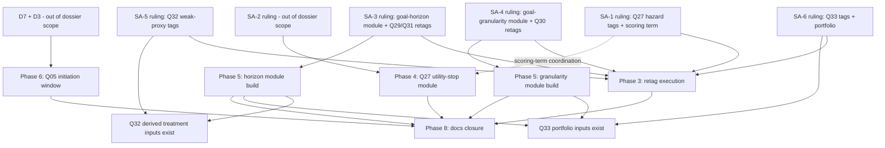

# NEXT-09 Phase 3 — Scientific Decision Dossier (SA-1, SA-3, SA-4, SA-5, SA-6)

Status: **DECISION-EVIDENCE DOSSIER — documentation only. Nothing in this
document is approved, implemented, or promoted.** Every recommendation below
is labelled RECOMMENDATION ONLY; every option awaits an explicit research-owner
ruling via the copy-paste ruling texts in §6. This dossier resolves no entry in
`docs/ai/SCIENTIFIC-AUTHORITY-AND-OPEN-DECISIONS.md` and edits no register,
matrix, schema, plan, room document, source file, or test.

- Base: `015bc0e` on `fable-autonomous-game-build-v1`
  (post-NEXT-09-phase-2 Q03 retrieval), branch
  `fable-next-09-phase3-decision-dossier-v1` (worktree, docs-only).
- Companion machine-readable file:
  `docs/research/next-09-phase3-decision-evidence.json`.
- Parent contract: `FABLE-NEXT-09-Q01-Q33-GAMEPLAY-COVERAGE.md` (§10 Phase 3:
  "SA-1/SA-3/SA-4/SA-5/SA-6 retag execution … applied verbatim and only as
  explicitly ruled — this contract pre-authorises nothing").
- Authority: CLAUDE.md domain hierarchy. This dossier sits **below every
  authority tier** — where it and any authority conflict, the authority wins.

## 1. Purpose and scope

NEXT-09 §10 Phase 3 cannot start until the research owner rules on the five
contested-mapping decisions SA-1, SA-3, SA-4, SA-5, SA-6, and Phases 5+ cannot
start until the module halves of SA-3/SA-4 are ruled. This dossier gives the
research owner everything needed to rule without reading the repository:

1. The **exact unresolved question** for each decision, reproduced verbatim
   from the register (§3).
2. A **repository-grounded evidence audit** per decision (§4): questionnaire
   construct, live structural mapping, actual gameplay embodiment, canonical
   events and payloads, scoring implications, opportunity/non-performance
   coding, route placement, counterbalancing, accessibility, burden, validity
   risks, feasibility, regression risk, affected tests.
3. **At least three clearly separated options per decision** (§5), each with
   benefits, validity risks, participant-facing effect, added median play
   time, files and systems affected, telemetry changes, migration
   implications, and acceptance tests.
4. **Copy-paste ruling text for every option** (§6) so the owner can approve
   or reject without ambiguity.
5. A **dependency graph** (§7) showing which NEXT-09 phases and Q-items each
   ruling unblocks, a **burden roll-up** (§8), a **sequencing plan with
   rollback boundaries** (§9), and the **independent reviewer record with
   transparent reconciliation** (§10).

Out of scope, deliberately: SA-2 (Q27 utility-stop module — its own ruling;
referenced only as a dependency), SA-7..SA-11, D2..D8, INT-1..INT-6,
spec-§8.2 principles. None is resolved, advanced, or reinterpreted here.

### 1.1 Evidence typology used throughout

Every claim in §4 carries one of four labels:

- **[AUTH]** — authoritative evidence: what a governing document says within
  its own domain (battery, measurement specification, event-schema,
  scoring-plan, V3, SA register).
- **[FACT]** — implemented fact: what the code, tests, or committed baselines
  at `015bc0e` demonstrably do, with file:line citations.
- **[INFER]** — reasonable inference: a conclusion drawn from [AUTH]+[FACT]
  that a reviewer could re-derive; never treated as approval.
- **[OPEN]** — unresolved choice: exactly what only the research owner may
  decide.

## 2. Method

Read-only audit of the tree at `015bc0e`: the SA register, the NEXT-09
contract, `docs/scientific/Q01-Q33_GAMIFIED_MEASUREMENT_SPECIFICATION.md`,
`docs/research/event-schema.md`, `docs/research/scoring-plan.md`,
`docs/research/research-traceability-matrix.json` (+ md companion),
`docs/research/MASTER_33_ALIGNMENT.md`, room documents under
`docs/game/rooms/`, `src/world/CanonicalEventContext.ts`,
`src/systems/ScoringManager.ts`, `SessionState`, emitting scenes, the
Playwright suite under `e2e/`, and `docs/game/UI-MANUAL-ACCEPTANCE-ROUTES.md`.
Four independent reviewers then inspected the repository themselves (§10).
No file outside the two dossier deliverables was modified.

## 3. The unresolved questions, reproduced verbatim

Source: `docs/ai/SCIENTIFIC-AUTHORITY-AND-OPEN-DECISIONS.md` §9.1 (register
current at `015bc0e`). The "Requires" column is the register's own.

> **SA-1 — Q27's live Hazard mapping.** `hazard_reckless_continue` is
> registered `study_item_ids: ['Q12','Q27','Q31']`,
> `construct_id: 'inappropriate_persistence'`, and is a term in
> `game_inappropriate_persistence`. The approved rationale makes utility-stop
> continuation Q27's primary analogue and keeps Hazard principally
> prudence/carefulness. Does `Q27` stay on this event (as secondary
> evidence), and does the event remain an inappropriate-persistence scoring
> term? — Evidence: `src/world/CanonicalEventContext.ts` (hazard block);
> `ScoringManager` `blind_retry_count`; `MASTER_33_ALIGNMENT.md` Q27 row;
> specification §Q27, §Q12. Requires: **Event-schema + scoring-plan**.

> **SA-3 — Q29/Q31 shared goal-horizon module.** No balanced horizon-choice
> module exists. Live: `stabiliser_option_offered`, `stabiliser_accepted`,
> `final_core_stability_bonus` → `['Q29']` (older delayed-benefit-side-repair
> rationale); `Q31` exists **only** on Hazard events. `MASTER_33_ALIGNMENT.md`
> further names **separate** Q29 (`delayed_benefit_investment`) and Q31
> (`informed_delay_choice`, `risky_shortcut_count`) variables — implementing
> those as written would **double count** one dimension. Approve: the module,
> its canonical events, and the **single shared** variable. — Evidence:
> `CanonicalEventContext.ts`; `MASTER_33_ALIGNMENT.md` Q29/Q31 rows;
> specification §Q29, §Q31, §8. Requires: **Event-schema + scoring-plan**.

> **SA-4 — Q30's live granularity mapping.**
> `inventory_verification_skipped` → `['Q02','Q30']` and
> `inventory_verified_complete` → `['Q30']` (`goal_time_exploratory`) infer
> Q30 from **skipped preparation**, which the approved rationale prohibits.
> No goal-granularity module (small independent work orders vs one integrated
> audit) exists; its candidates are unapproved. Approve: removing/retaining
> the Q30 tags, and the granularity module's events and variable. — Evidence:
> `CanonicalEventContext.ts` (inventory block); `MASTER_33_ALIGNMENT.md` Q30
> row; specification §Q30. Requires: **Event-schema + scoring-plan**.

> **SA-5 — Q32 raw tags.** `side_repair_completed` → `['Q07','Q16','Q32']`
> and `final_bonus_unlocked` → `['Q32']`. Approved rationale: very weak
> extended-goal engagement proxy; **no distinct validated Q32 game score**.
> No Q32 score exists today (`optional_future_benefit_score` is
> unimplemented). Confirm the raw Q32 tags may remain as weak-proxy
> telemetry, and that `optional_future_benefit_score` is **not** to be
> implemented as a Q32 score. — Evidence: `CanonicalEventContext.ts`;
> `scoring-plan.md` §2; specification §Q32. Requires: **Event-schema**
> (scoring-plan only if a proxy variable is ever authorised).

> **SA-6 — Q33's live Final-Core mapping.** `final_core_rushed` →
> `['Q11','Q33']`, `final_core_issue_resolved` → `['Q33']`,
> `final_core_completed` → `['Q06','Q33']` infer Q33 from **rushing /
> resolution of unresolved issues**, which the approved rationale prohibits.
> The approved alternative is an end-session portfolio over **self-selected**
> goal opportunities (excluding required short tasks) — which depends on
> SA-3/SA-4 existing first. Approve: removing/retaining the Q33 tags, and
> whether the portfolio variable is authorised. — Evidence:
> `CanonicalEventContext.ts` (final-core block); `MASTER_33_ALIGNMENT.md`
> Q33 row; specification §Q33. Requires: **Event-schema + scoring-plan**.

Standing constraints reproduced from the register that bound every option
below [AUTH]:

- §6 Q29/Q31: one shared dimension; options never labelled
  "short-term"/"long-term"; initial choice logged before an interruption; one
  choice never two observations; exploratory.
- §6 Q30: repeated balanced choices; ≥2 valid opportunities preferred; never
  inferred from carelessness, skipped preparation, or Hazard.
- §6 Q32: long-term-oriented, NOT reverse-scored; questionnaire-primary; no
  distinct validated Q32 game score.
- §6 Q33: never inferred from Final-Core rushing/quality/unresolved issues;
  only self-selected opportunities; required short tasks never count;
  questionnaire-primary.
- §7: goal-horizon and goal-granularity are shared modules; Q32/Q33 get no
  module of their own.
- §11: no autonomous resolution; a missing mapping is a stop condition.
- NEXT-09 §9: two valid counterbalanced horizon instances required; Q30
  needs ≥2 instances; burden target ≈8-10 added median minutes for all
  required NEXT-09 additions together; Q18/Q20 optional arcs sit outside
  that budget and remain non-blocking.

## 4. Repository-grounded evidence audits

All line numbers refer to the tree at `015bc0e`. A cross-cutting implemented
fact that shapes every option below:

- **[FACT] Retagging is scoring-neutral.** `ScoringManager` counts events by
  `event_type` string only (`src/systems/ScoringManager.ts:390-392`); no
  formula reads `study_item_ids` or `construct_id`. Editing a
  `CanonicalEventContext` registration changes exported payload context and
  analysis-side traceability, never a summary variable. Only SA-1-C (formula
  edit) touches scoring output.
- **[FACT]** `CANONICAL_EVENT_CONTEXT` holds 90 registrations and is
  `Object.freeze`d with every `study_item_ids` array
  (`src/world/CanonicalEventContext.ts:510-517`).
- **[FACT]** The legacy MASTER_33 derived names for this family —
  `uncertainty_inappropriate_count`, `reckless_shortcut_count`,
  `risky_shortcut_count`, `short_term_shortcut_count`,
  `rush_to_finish_count`, `delayed_finalization_score`,
  `delayed_benefit_investment`, `informed_delay_choice`,
  `final_stability_gain`, `preparation_delay_benefit` — occur **nowhere in
  `src/`**; they exist only in `MASTER_33_ALIGNMENT.md`, room docs, and
  matrix annotation text. Nothing implemented depends on them.

### 4.1 SA-1 — Q27's live Hazard mapping

- **Construct [AUTH].** Q27 = IP-01, "Sometimes I find myself continuing to
  do something, even when there is no point in carrying on", positive-scored
  as maladaptive (spec §Q27). Approved primary analogue: continuation after
  an explicit utility-stop signal; "Prefer this over the older Hazard
  shortcut mapping, which mainly measured prudence" (spec §Q27, Current
  design decision). Hazard remains principally prudence (register §6 Q27).
- **Live structural mapping [FACT].** `hazard_reckless_continue:
{ study_item_ids: ['Q12','Q27','Q31'], construct_id:
'inappropriate_persistence', success: null }`
  (`CanonicalEventContext.ts:215-224`). `hazard_info_checked` also carries
  `['Q12','Q27']` with construct intentionally unset
  (`CanonicalEventContext.ts:199-203`) — SA-1's register text names only
  `hazard_reckless_continue`, but a Q27 ruling that strips the reckless
  event and leaves `hazard_info_checked` untouched would leave a second,
  weaker Q27-on-Hazard tag in place; the ruling texts in §6 therefore cover
  both explicitly.
- **Gameplay embodiment [FACT].** Emitted at
  `src/scenes/HazardScene.ts:216-220` when the participant picks "continue"
  without having checked the warning detail
  (`hazardTaskState.get().infoChecked === false`); metadata
  `info_checked_before_continuing` (always false on this branch); prompt is
  repeatable by design — **no one-shot guard** (`hazard_warning_seen` fires
  on every prompt open, `HazardScene.ts:153`). Legacy prototype site
  `Main.tsx:857` is off-route.
- **Scoring implications [FACT].** The event is a term of
  `blind_retry_count` (`ScoringManager.ts:80-83`), whose value **is** the
  whole of `game_inappropriate_persistence` (`ScoringManager.ts:102`), and
  it is subtracted inside `failure_adaptation_index`
  (`ScoringManager.ts:103-110`) and hence `game_persistence_total`
  (`ScoringManager.ts:111-117`). The register's summary ("is a term in
  `game_inappropriate_persistence`") is confirmed with this sharper shape:
  removing the term changes four exported summary variables.
  `hazard_info_checked` — the second Q27-tagged event — is itself a scoring
  term (`strategy_revision_count`, `ScoringManager.ts:84-87`, and
  `game_uncertainty_persistence`, `ScoringManager.ts:100-101`); since
  formulas key on event names, the SA-1-B tag edit leaves both untouched.
- **Opportunity/non-performance coding [FACT/INFER].** Hazard is an
  always-available optional room; a session that never visits it emits
  nothing — currently indistinguishable in the Q27 column from "visited and
  behaved prudently" except via `hazard_warning_seen` presence [INFER:
  analysts can reconstruct opportunity from `hazard_warning_seen`, but no
  explicit no-opportunity coding exists; spec §8.2 leaves no-opportunity
  coding an open principle].
- **Route/counterbalancing.** Not applicable — no new surface is proposed
  under SA-1 itself; the replacement analogue is SA-2's module (out of
  scope).
- **Accessibility/burden.** All options 0 added minutes; no
  participant-facing change.
- **Validity risks [INFER].** Keeping Q27 on a prudence-context event
  contaminates the Q27 behavioural column with risk-taking variance the
  approved rationale explicitly rejects; the missing one-shot guard also
  lets a single participant inflate the count by re-opening the prompt.
  Conversely, dropping Q27 before SA-2's module exists leaves Q27 with no
  in-game analogue at all (questionnaire still covers it — Q27 is not
  questionnaire-primary, but the battery is always administered).
- **Feasibility/regression [FACT].** Tag-only edits compile trivially and
  change no emission or formula. The formula edit (Option C) alters
  `game_inappropriate_persistence`, `blind_retry_count` composition,
  `failure_adaptation_index`, `game_persistence_total` — it invalidates any
  stored summary-variable expectations in specs and the Route G
  summary-side assertions if any exist, and creates a scoring-plan
  documentation obligation.
- **Affected tests [FACT].** See §4.6 test-impact table.

### 4.2 SA-3 — Q29/Q31 shared goal-horizon module

- **Construct [AUTH].** Q29 (GTP-01, long-term pole) and Q31 (GTP-04,
  short-term pole) are "opposite ends of the same behavioural preference
  dimension" (spec §Q31); one shared variable; options never labelled
  short-/long-term; matched effort, value, difficulty, risk, attractiveness
  and social approval; initial choice recorded before any interruption;
  "Ideally repeated in a second balanced opportunity with option order
  counterbalanced" (spec §Q29 measurement window); "Order and framing must
  be counterbalanced" (spec §Q31 confounds). NEXT-09 §9 hardens the
  spec's "ideally" into a contract requirement: "Q29/Q31 require two valid
  counterbalanced instances of the one shared choice".
- **Live structural mapping [FACT].** `stabiliser_option_offered` and
  `stabiliser_accepted` → `['Q29']`, `goal_time_exploratory`
  (`CanonicalEventContext.ts:363-371`); `final_core_stability_bonus` →
  `['Q29']` (`:499-504`); `hazard_informed_continue` → `['Q31']`
  (`:204-214`); `hazard_reckless_continue` carries `'Q31'` in its triple
  (`:215-224`). No horizon-choice module exists anywhere in `src/` [FACT:
  no operations/planning console exists; the Hub "Priority Allocation
  Console" is pilot-scenario telemetry, and the Hub status board is
  display-only].
- **Gameplay embodiment [FACT].** The events that carry Q29 today are the
  side-repair offer/accept (an optional-diligence arc shared with
  Q07/Q16/Q20) and a **system-emitted entry flag**:
  `final_core_stability_bonus` fires once per session at Final Core entry
  iff `side_repair_status === completed`
  (`FinalCoreScene.ts:250, 274-275`) — no participant choice occurs at its
  emission moment. Q31's only carriers are the Hazard continue branches.
  Neither is a balanced horizon choice.
- **Scoring implications [FACT].** None of
  `stabiliser_option_offered`/`stabiliser_accepted`/
  `final_core_stability_bonus` is counted by ScoringManager.
  `hazard_informed_continue` feeds `game_uncertainty_persistence`
  (`ScoringManager.ts:100-101`) and `failure_adaptation_index` positively —
  as prudence/persistence signal, not Goal-Time. No Q29/Q31 derived variable
  exists; `delayed_benefit_investment`/`informed_delay_choice`/
  `risky_shortcut_count` were never implemented.
- **Opportunity/non-performance coding [AUTH/INFER].** The module's own
  events must encode opportunity (`horizon_choice_offered`) separately from
  choice — the candidate set does this. A session ending before the first
  instance is a no-opportunity state, never non-performance [AUTH: spec §8
  principles; exact coding is a spec-§8.2 open principle].
- **Route/horizon placement [AUTH/FACT].** Spec: "After the player
  understands game mechanics but before the Interruption Corridor." The
  route is free-roam after the Dock ([FACT] NEXT-09 §5.1), so "before the
  Corridor" cannot be guaranteed by room order alone. **Design conflict on
  the guarantee mechanism [FACT/OPEN]:**
  `docs/game/rooms/07-interruption-corridor.md:193-195` records, as a
  settled design statement, that "corridor entry order stays configurable —
  the corridor imposes no ordering constraint on any future horizon-choice
  module; nothing here logs before/after any other room by design." Gating
  the beacon offer on the first horizon commitment would be exactly such an
  ordering constraint — choosing it requires the owner to **explicitly
  amend that room-doc statement**, and it would change beacon behaviour on
  the existing Route G drive sequence (see §4.6/§9). The gate-free
  alternative is validity coding: if the beacon fires before instance 1
  commits, that instance is coded invalid-opportunity for the horizon
  measurement (free roam preserved; risk of sessions with fewer than two
  valid instances). The mechanism is an explicit sub-field of the SA-3
  ruling (§6, sub-field (iv)) — not resolved here.
- **Counterbalancing [AUTH].** Two instances, option order counterbalanced
  across sessions (deterministic from `game_session_id` parity or condition
  field — mechanism is an implementation detail; the requirement is the
  contract's).
- **Accessibility/burden.** Card-panel only, keyboard/mouse parity, no
  timers or drag (NEXT-09 §9); Option B ~3-4 min, Option C ~5-6 min (§8).
- **Validity risks [INFER].** (i) Distributed option must not read as
  virtuous — copy review gate; (ii) completion ≠ preference: follow-through
  events stay separate measures (spec §Q29 primary measurements);
  (iii) shared-module rule — one choice never counts for Q29 and Q31
  separately; (iv) leaving the superseded tags in place while the module
  runs would double-home Q29/Q31 across two rationales in one dataset.
- **Feasibility/regression [FACT/INFER].** New module is additive: new
  scene-surface(s) + SessionState field(s) + registrations + events. The
  Route G kit-less replay must stay zero-diff; new events enter the
  allowlist. The retag slice alone is compile-safe and emission-neutral.
- **Affected tests.** §4.6.

### 4.3 SA-4 — Q30's live granularity mapping

- **Construct [AUTH].** Q30 = GTP-03, "I usually work towards small goals",
  goal granularity: several independently closable work orders vs one
  integrated multi-component audit, approximately equal total actions/
  benefit/difficulty; "Require at least two valid opportunities before
  deriving a behavioural pattern" (spec §Q30 current design decision);
  never inferred from carelessness, skipped preparation, or Hazard
  (register §6 Q30).
- **Live structural mapping [FACT].** `inventory_verified_complete` →
  `['Q30']`, `goal_time_exploratory` (`CanonicalEventContext.ts:330-334`);
  `inventory_verification_skipped` → `['Q02','Q30']`, construct unset
  (`:301-305`). Both are verification-skip carriers — precisely the
  prohibited skipped-preparation inference [AUTH: register §9.1 SA-4].
- **Gameplay embodiment [FACT].** Emission sites: verify acts at
  `InventoryScene.ts:415, 1121, 786`; skip acts at `:379, 1130, 800`
  (legacy options and per-item close-out). These are Q02/Q16-relevant
  verification behaviour; no goal-structure choice exists anywhere in
  `src/`.
- **Scoring implications [FACT].** Neither event is counted by
  ScoringManager (organisation variables consume other inventory events);
  `short_term_shortcut_count`/`preparation_delay_benefit` were never
  implemented. Retag is scoring-neutral; Q02's tag on
  `inventory_verification_skipped` is untouched by every SA-4 option.
- **Opportunity/non-performance [AUTH/INFER].** As SA-3: opportunity events
  (`goal_structure_choice_offered`) separate from choice; a session that
  never reaches the console is no-opportunity.
- **Route placement/counterbalancing [AUTH/INFER].** Spec: one choice at
  Inventory/Prep, "preferably one later choice in maintenance/final
  preparation", recorded before outcome feedback; ≥2 valid opportunities;
  instance order/framing balance analogous to SA-3. The second surface
  needs a host (contract §8.2 suggests a non-inventory station) — owner
  design detail.
- **Accessibility/burden.** Option B ~2-3 min; Option C ~3-4 min; card
  panel, parity rules as SA-3.
- **Validity risks [INFER].** (i) The choice must restructure the same
  work, never change its amount (NEXT-09 §6 Q30 invariance) — otherwise it
  measures effort preference; (ii) subgoal-decomposition can reflect good
  planning (spec confound) — copy must not make small orders look like the
  organised option; (iii) keeping the prohibited tags alongside a live
  granularity module would mix two incompatible Q30 operationalisations in
  one dataset.
- **Feasibility/regression [FACT/INFER].** Additive module + retag slice as
  SA-3. The inventory close-out flow is heavily specified and one-shot
  (`isPrepCompleted()` gate, `InventoryScene.ts:159-166`) — the granularity
  choice must sit before/around it without touching its events (regression
  risk concentrated here; Route G covers it).
- **Affected tests.** §4.6.

### 4.4 SA-5 — Q32 raw tags

- **Construct [AUTH].** Q32 = GTP-02, "Most of the goals I work on take
  years to finish", long-term-oriented, **not** reverse-scored;
  questionnaire-primary; very weak proxy; "No distinct Q32 game score"
  (spec §Q32); no module of its own ever (register §7); evidence, if any,
  derives from ≥2 valid horizon-related opportunities (spec §Q32
  measurement window) — which only the SA-3 module can create.
- **Live structural mapping [FACT].** `side_repair_completed` →
  `['Q07','Q16','Q32']`, construct unset (`CanonicalEventContext.ts:
345-353`); `final_bonus_unlocked` → `['Q32']`, `goal_time_exploratory`
  (`:372-376`).
- **Gameplay embodiment [FACT].** Both fire on the side-repair completion
  act (`SideRepairScene.ts:499-500`, third work-console stage, one-shot via
  `markRoomCompleted`). The participant experience is the optional-
  diligence arc (Q07/Q16 primary); Q32 rides along as a weak-proxy tag —
  consistent with TELEMETRY-ONLY-by-design (NEXT-09 §6 Q32).
- **Scoring implications [FACT].** `side_repair_completed` feeds
  `productiveness_side_task_count` and
  `productiveness_completed_optional_task` (`ScoringManager.ts:133-136,
187-188`) — productiveness variables keyed by event name; the Q32 tag
  contributes to no formula. `final_bonus_unlocked` is uncounted.
  `optional_future_benefit_score` is named missing in `scoring-plan.md`
  §2 (line 50) and implemented nowhere [FACT].
- **Opportunity/non-performance [INFER].** Q32's proxy inherits the side
  repair arc's opportunity structure (offer events); no Q32-specific coding
  exists or is needed under any option here.
- **Route/counterbalancing/accessibility/burden.** No surface under any
  option; 0 minutes; not applicable.
- **Validity risks [INFER].** (i) Retaining the tags costs little — they
  are analysis-side annotations on genuinely emitted acts, and the
  weak-proxy framing is already the approved reading; (ii) trimming them
  (Option B) leaves Q32 with zero game telemetry until Phase 5 lands,
  which is scientifically clean but discards the only convergent-validity
  breadcrumb currently collected; (iii) authorising a proxy variable
  (Option C) before the SA-3 inputs exist would force it to be computed
  from the very side-repair events whose Q32 reading is the weak
  superseded-adjacent one — hence Option C is worded as conditional on
  Phase 5.
- **Feasibility/regression [FACT].** Tag edits scoring-neutral; Option C
  adds a labelled scoring-plan variable only after Phase 5 (mandatory
  exploratory label per `scoring-plan.md` §8 lines 144-151).
- **Affected tests.** §4.6; plus the NEXT-09 absence rule: "no
  Q32-specific surface may ever appear" stays a standing test obligation
  under every option.

### 4.5 SA-6 — Q33's live Final-Core mapping

- **Construct [AUTH].** Q33 = GTP-05, "Most goals I accomplish only take a
  few days to complete", short-duration pole; questionnaire-primary; weak
  proxy; approved treatment is an end-of-session portfolio "using only
  genuine self-selected opportunities, not required short room tasks"
  (spec §Q33 measurement window); never inferred from Final-Core rushing,
  poor quality, or unresolved issues (register §6 Q33).
- **Live structural mapping [FACT].** `final_core_rushed` →
  `['Q11','Q33']`, construct unset (`CanonicalEventContext.ts:466-470`);
  `final_core_issue_resolved` → `['Q33']`, `goal_time_exploratory`
  (`:489-492`); `final_core_completed` → `['Q06','Q33']`, construct unset
  (`:493-498`).
- **Gameplay embodiment [FACT].** All three fire inside the Final Core
  interface — a **required** route element behind the four-scenario gate:
  `final_core_rushed` on option 1 (quick sync, `FinalCoreScene.ts:313`),
  `final_core_issue_resolved` on option 3 only while issues are
  outstanding (`:351`), `final_core_completed` on all four completion
  options (`:316, 332, 355, 382`), one-shot per session. Required-task
  evidence is exactly what the approved rationale excludes from Q33.
- **Scoring implications [FACT].** None of the three events is counted by
  ScoringManager under those names (the summary boolean
  `final_core_completed` derives from the legacy quality-tier events,
  `ScoringManager.ts:146-149`); `rush_to_finish_count`/
  `delayed_finalization_score` were never implemented. Retag is
  scoring-neutral; Q11 on `final_core_rushed` and Q06 on
  `final_core_completed` are untouched by every SA-6 option.
- **Opportunity/non-performance [AUTH].** The portfolio (if authorised) is
  computed at session end over self-selected SA-3/SA-4 opportunities with
  a valid-opportunity count in the denominator (spec §Q33 primary
  measurements) — sessions with <2 valid opportunities yield no portfolio,
  coded as no-opportunity, never as short-goal preference [AUTH: spec;
  exact incomplete-session handling is spec-§8.2 open].
- **Route/counterbalancing/accessibility/burden.** No surface under any
  option; 0 minutes. The portfolio inherits SA-3/SA-4 counterbalancing.
- **Validity risks [INFER].** (i) Retaining Q33 on required Final-Core
  acts keeps a structurally invalid inference available to any future
  analyst — the highest-risk status quo of the five decisions;
  (ii) removing the tags (Option B) leaves Q33 questionnaire-only until
  Phase 5 + SA-6-C — acceptable for a questionnaire-primary item;
  (iii) the portfolio variable must never ingest required-task
  completions — acceptance tests must assert the exclusion.
- **Feasibility/regression [FACT].** Tag edits scoring-neutral; portfolio
  variable (Option C) is post-Phase-5 scoring-plan work with mandatory
  exploratory label.
- **Affected tests.** §4.6.

### 4.6 Test-impact evidence (suite = 36 spec files under `e2e/`, `playwright.config.ts` testDir `./e2e`)

[FACT] These specs assert the current `study_item_ids`/`construct_id`
**values** of the contested events and would need updating under any
tag-removal ruling (retags change no emission, so all other assertions
survive):

| Contested registration                                       | Value-pinning assertions                                                                            |
| ------------------------------------------------------------ | --------------------------------------------------------------------------------------------------- |
| `hazard_info_checked` `['Q12','Q27']`                        | `e2e/hazard_control_logging.spec.ts:123`                                                            |
| `hazard_reckless_continue` `['Q12','Q27','Q31']` + construct | `e2e/hazard_control_logging.spec.ts:169-170`                                                        |
| `hazard_informed_continue` `['Q31']` + construct             | `e2e/hazard_control_logging.spec.ts:127`; `e2e/adversarial_hazard_repeat_decisions.spec.ts:143-144` |
| `side_repair_completed` `['Q07','Q16','Q32']`                | `e2e/side_repair_logging.spec.ts:182`                                                               |
| `final_bonus_unlocked` `['Q32']` + construct                 | `e2e/side_repair_logging.spec.ts:184-185`                                                           |
| `inventory_verification_skipped` `['Q02','Q30']`             | `e2e/inventory_prep_logging.spec.ts:111`                                                            |
| `inventory_verified_complete` `['Q30']` + construct          | `e2e/inventory_prep_logging.spec.ts:163-164`                                                        |
| `final_core_completed` `['Q06','Q33']`                       | `e2e/final_core_summary.spec.ts:101`                                                                |
| `final_core_rushed` `['Q11','Q33']`                          | `e2e/final_core_summary.spec.ts:217-218`                                                            |

Presence/ordering assertions that survive every retag (event names and
moments unchanged): hazard `hazard_control_logging.spec.ts:114-292`,
`adversarial_hazard_repeat_decisions.spec.ts:101-136`; side repair
`side_repair_logging.spec.ts:110-603`; inventory
`inventory_prep_logging.spec.ts:94-793`; final core
`final_core_summary.spec.ts:72-227`, `scenario_route_gate.spec.ts:130-222`;
journeys `connected_participant_journeys.spec.ts:197-560`.

[FACT] Route G baselines (`e2e/route-g/route-g-a.baseline.json`,
`route-g-b.baseline.json`) compare ordered `(event_type, sorted payload
keys, sorted metadata keys)` — **values excluded**. Consequence for Phase 3
execution: removing an item ID from a `study_item_ids` array is
Route-G-invisible; **deleting a `construct_id` field removes a payload key
and diffs Route G** (the key appears 44× per baseline). Any ruling whose
edit empties a registration (`['Q29']` → `[]` etc.) must state whether
`construct_id` is kept (shape-stable, but a Goal-Time construct label on an
unmapped event) or removed (cleaner; requires a deliberate, reviewed Route G
re-baseline in the same commit). The ruling texts in §6 make this choice
explicit per event.

[FACT] The traceability validator (`scripts/validate-traceability-matrix.mjs`)
machine-derives the matrix `events` section from `CanonicalEventContext` +
`ScoringManager` + `src/`/`e2e/` scans and byte-compares; after any retag the
matrix must be regenerated with `--write` from an LF checkout. Its
`ALLOWED_DECISIONS` list is `['D2','D3','D4','D5','D6','D7','D8',
'UD-HAZARD-CONSEQUENCE']` (lines 316-325) — **SA-references are not legal in
`blocking_decisions`** and must stay in notes text.

[FACT] Matrix governance finding (recorded, not fixed here): the
hand-authored `items` rows for Q27/Q29/Q30/Q31/Q32/Q33 still read
`"operationalisation":"implemented"` with empty `gaps` and
`unresolved_decisions`, listing the superseded events and the
never-implemented MASTER_33 derived names (e.g. Q29's
`delayed_benefit_investment`, Q33's `rush_to_finish_count`) — the matrix
presents the superseded operationalisation as current and nowhere mentions
SA-1..SA-6. The md companion rows (L83-89) match. Truthing these rows up is
Phase 3/P8 documentation work that becomes unambiguous once the rulings
exist; this dossier deliberately does not touch them.

## 5. Options per decision

Every option below is unapproved. Time = added median participant minutes.
"Files" lists the expected change surface for the eventual ruled execution
(no file is changed by this dossier). Option letters: **A = conservative
no-change / telemetry-only**, **B = minimal scientifically defensible
embodiment**, **C = fuller embodiment**.

### 5.1 SA-1 (Q27 on Hazard; scoring term)

**SA-1-A — Retain both tags and the scoring term; document Q27-on-Hazard as
secondary, superseded-rationale evidence.**

- Benefits: zero regression; preserves cross-pilot comparability of
  `game_inappropriate_persistence`; keeps a (weak) behavioural Q27
  breadcrumb until SA-2's module exists.
- Validity risks: Q27's behavioural column stays contaminated with prudence
  variance the approved rationale rejects; repeatable prompt (no one-shot
  guard) allows count inflation; documented caveat depends on analyst
  discipline.
- Participant-facing effect: none. Time: 0.
- Files: `docs/research/event-schema.md` (caveat note),
  matrix JSON/MD notes text, `docs/ai/SCIENTIFIC-AUTHORITY-AND-OPEN-DECISIONS.md`
  §9.1 (ruling record), `docs/game/rooms/05-hazard-control.md`.
- Telemetry changes: none. Migration: none.
- Acceptance tests: existing suite green unchanged; Route G zero-diff.

**SA-1-B — Remove Q27 from the Hazard events; keep the scoring term
unchanged pending D2/SA-2. (RECOMMENDATION ONLY — see §5.6)**

- Edits: `hazard_reckless_continue` → `study_item_ids: ['Q12','Q31']`
  (the `'Q31'` entry is SA-3's question and is untouched by this ruling);
  `hazard_info_checked` → `['Q12']`. `construct_id` fields untouched
  (no Route G impact). `blind_retry_count`/`game_inappropriate_persistence`
  formulas untouched.
- Benefits: aligns production traceability with the approved rationale at
  zero scoring risk; makes the Q27 column unambiguous (empty until SA-2);
  smallest defensible edit.
- Validity risks: Q27 has no behavioural analogue until Phase 4 — the
  battery still measures it; the scoring term retains a reckless-continue
  contribution inside an inappropriate-persistence variable (construct
  mixing persists at the formula layer until SA-1-C/D2).
- Participant-facing effect: none. Time: 0.
- Files: `src/world/CanonicalEventContext.ts`;
  `e2e/hazard_control_logging.spec.ts:123,169`; `docs/research/event-schema.md`;
  matrix JSON/MD (`--write` + hand rows); SA register §9.1; room doc 05.
- Telemetry changes: value-only payload change (`study_item_ids` array
  contents); no emission/shape change; Route G zero-diff.
- Migration: analysis pipelines keyed on Q27 tags stop receiving hazard
  rows from the change date; raw event names unchanged, so historical and
  new exports remain mergeable at the event level.
- Acceptance tests: updated value assertions; full suite green; Route G
  zero-diff replay.

**SA-1-C — Remove Q27 from the Hazard events AND remove
`hazard_reckless_continue` from the inappropriate-persistence formula.**

- Edits: SA-1-B plus `ScoringManager.ts:80-83` `blind_retry_count` drops the
  hazard term (formula becomes the two identical-repetition terms
  [+ `final_core_force_continue` if/when D2 sub-item 2 is separately
  approved]); `failure_adaptation_index` and `game_persistence_total`
  change by composition; `scoring-plan.md` formula rows updated.
- Benefits: completes the construct separation (recklessness no longer
  scored as persistence); `game_inappropriate_persistence` becomes a pure
  identical-repetition/forcing measure consistent with register §4 rule 4.
- Validity risks: changes four exported summary variables mid-programme —
  breaks comparability with any data collected under the old formula;
  removes reckless behaviour from every summary variable until a
  prudence-side variable (D2-family, unauthorised) exists — the signal
  survives only as raw events.
- Participant-facing effect: none. Time: 0.
- Files: SA-1-B files + `src/systems/ScoringManager.ts`,
  `docs/research/scoring-plan.md`; any spec asserting summary values for
  the four variables (executor must grep `getSummary` assertions).
- Telemetry changes: summary-variable values change; raw stream unchanged.
- Migration: summary-level longitudinal comparisons need a formula-version
  flag; recommend only if no pilot data has been collected under the old
  formula or a version marker is added.
- Acceptance tests: updated formula unit/e2e expectations; full suite;
  Route G zero-diff (raw stream untouched).

### 5.2 SA-3 (Q29/Q31 goal-horizon module + superseded tags)

**SA-3-A — No module; retain the superseded tags with a formal
superseded-status caveat (telemetry-only).**

- Benefits: zero build cost and burden; no regression surface; Q29/Q31
  measured by questionnaire only.
- Validity risks: Q29/Q31 keep **structurally invalid** behavioural
  telemetry (Q29 on an optional-diligence arc incl. a system-emitted entry
  flag; Q31 on prudence events); the contract's two-counterbalanced-
  instances requirement is **not satisfied** — Q29/Q31 stay ABSENT and the
  Q32 derived treatment and Q33 portfolio remain impossible (their inputs
  never exist). Phase 5's horizon half is cancelled, not deferred.
- Participant-facing effect: none. Time: 0.
- Files: docs only (schema note, matrix notes, register, room docs 06/08).
- Telemetry/migration: none.
- Acceptance tests: suite unchanged.

**SA-3-B — Minimal shared-dimension module: two counterbalanced instances +
tag cleanup. (RECOMMENDATION ONLY — see §5.6)**

- Module: instance 1 on a new Hub operations terminal (new interactable in
  `HubScene`; card panel via `renderPromptStage`), committing **before the
  Corridor beacon can fire** — guarantee mechanism is ruling sub-field
  (iv): a beacon gate (requires explicitly amending the room-doc-07
  no-ordering-constraint statement and reordering the Route G drive
  sequence) or gate-free validity coding (§4.2); instance 2
  later, differently skinned (candidate hosts: Engineer Hub planning
  option on the existing Kai tree, or a second terminal — owner sub-choice
  in the ruling). Each instance: two work orders of matched total effort/
  value/difficulty — one self-contained with immediate closure, one
  distributed with closure near Final Core; neutral copy, no time labels;
  option order counterbalanced deterministically across sessions (e.g.
  `game_session_id` parity); one-shot commit per instance, logged before
  any interruption.
- Canonical events (all CANDIDATE until this ruling):
  `horizon_choice_offered`, `option_details_viewed`,
  `immediate_goal_selected`, `distributed_goal_selected`,
  `distributed_goal_revisited`, `distributed_goal_completed` — payload
  `metadata.instance_id` (1|2) + `metadata.option_order`; ONE shared
  derived variable `goal_horizon_preference` (scoring-plan; exploratory
  label per scoring-plan §8 mandatory).
- Tag cleanup in the same ruling: `stabiliser_option_offered`,
  `stabiliser_accepted`, `final_core_stability_bonus` →
  `study_item_ids: []` (Q29 removed); `hazard_informed_continue` → `[]`
  (Q31 removed); `hazard_reckless_continue` drops `'Q31'` from its array.
  `construct_id` handling per §4.6: ruling states keep-or-remove; removal
  requires the reviewed Route G re-baseline.
- Benefits: satisfies the register's shared-dimension constraints and the
  contract's two-counterbalanced-instances requirement exactly; creates
  Q32/Q33 input events; smallest surface that makes Q29/Q31 measurable.
- Validity risks: matched-effort/value copy is hard — requires wording
  review against battery vocabulary; distributed option must not read
  virtuous; completion confounded with everything downstream (kept as
  separate follow-through measures, never folded into preference).
- Presentation-constraint flag [FACT]: counterbalanced option order
  collides with `RoomScene.ts:801-806`, quoted in full: "presentation is
  uniform across rooms and participants — interaction salience must never
  vary — and options render in their declared order, never randomised or
  reordered." Counterbalancing varies which option a participant sees
  first, so the owner is being asked to waive the **across-participants
  uniformity clause** for these two instances specifically — not merely the
  render-time no-randomisation clause. The amendment note must say so
  (deterministic per-session declared order, uniform within a session,
  salience-equal card styling). Burden is order-neutral, so no
  cross-session burden asymmetry results.
- Burden assumption [INFER]: the ~3-4 min median assumes distributed-
  closure travel rides the existing end-of-route walk; consistent
  distributed-choosers may reach ~4-6 min (burden review estimate).
- Participant-facing effect: two new terminal interactions + the chosen
  work order's steps. Time: ~3-4 min.
- Files (build): `src/scenes/HubScene.ts`, second-host scene file,
  `src/data/researchInteractions.ts`, `src/systems/SessionState.ts` (new
  horizon fields), `src/world/CanonicalEventContext.ts` (6 new
  registrations + 5 tag edits), `src/systems/ScoringManager.ts`
  (`goal_horizon_preference`), new `e2e/horizon_choice_logging.spec.ts`,
  `e2e/route_g_telemetry` allowlist (plus drive-sequence reorder if the
  beacon gate is the ruled ordering mechanism), `e2e/journey.ts`/DEV probe
  helpers for driving the new stations, `proc-*` terminal textures via the
  existing procedural foundry (no PixelLab), docs (event-schema §,
  scoring-plan §, matrix `--write` + hand rows, room docs incl. the
  room-doc-07 amendment if gated, UI-MANUAL-ACCEPTANCE-ROUTES Route 14,
  SA register).
- Telemetry changes: 6 additive events; 5 registrations edited; 1 derived
  variable added.
- Migration: old Q29/Q31 columns end at the change date; new shared
  variable begins; raw legacy events keep firing unchanged (names/moments
  untouched) so longitudinal event-level analysis survives.
- Acceptance tests: choice-before-interruption assertion; counterbalance
  both orders across two sessions; one-shot per instance; matched-copy
  audit; single-shared-variable assertion (no Q29-only/Q31-only variable
  exists); keyboard/mouse parity; readability at 800×600 (manual-route
  extension of routes 10/11); Route G: legacy replay zero-diff, new
  events allowlisted in contracted positions; updated §4.6 value
  assertions.

**SA-3-C — Fuller distributed arc: SA-3-B plus staged distributed
objective.**

- Adds: the distributed work order decomposed into 2-3 visible stages
  across stations (`distributed_stage_completed` per stage, CANDIDATE),
  richer revisit tracking, and Q32-ready sustained-engagement inputs
  (`distributed_goal_unresolved` at Final Core entry, CANDIDATE).
- Benefits: stronger follow-through evidence (spec's "later return and
  completion kept as separate follow-through measures"); best possible Q32
  input quality.
- Validity risks: burden growth (§8: risks breaching the 8-10 min budget
  once SA-2/Q05 land); more copy to review; stage placement entangles
  other rooms' frozen surfaces — larger regression surface; diligence/
  persistence overlap grows (spec §Q32 confound).
- Participant-facing effect: two instances + multi-stage distributed work.
  Time: ~5-6 min.
- Files: SA-3-B set + per-stage surfaces in 2-3 station scenes.
- Telemetry: SA-3-B + 2 more event names. Migration: as B.
- Acceptance tests: SA-3-B set + per-stage unlock/ordering tests.

### 5.3 SA-4 (Q30 granularity module + prohibited verification tags)

**SA-4-A — No module; retain the Q30 verification tags with a formal
superseded-status caveat (telemetry-only).**

- Benefits: zero cost; Q02's reverse-organisation reading of the same
  events is untouched.
- Validity risks: keeps exactly the inference the approved rationale
  prohibits ("never inferred from … skipped preparation") live in
  production traceability; Q30 unmeasurable behaviourally; Q33 portfolio
  loses its granularity half permanently.
- Participant/time/telemetry: none/0/none. Files: docs only.
- Acceptance tests: suite unchanged.

**SA-4-B — Minimal granularity module: two structure-choice instances + tag
removal. (RECOMMENDATION ONLY — see §5.6)**

- Module: instance 1 at the Quartermaster Console — before per-item prep
  begins, the participant chooses to take the same prep work as (a)
  several independently closable small work orders or (b) one integrated
  order closing all at once; the choice **restructures presentation only**
  (same items, same actions, same close-out; the one-shot
  `isPrepCompleted()` close-out flow and all existing inventory events
  untouched). Instance 2 at a non-inventory station (candidate hosts per
  contract §8.2: the Hub operations terminal's maintenance bundle or the
  Engineer Hub calibration bench bundle — owner sub-choice). Choice
  recorded before outcome feedback; one-shot per instance; order
  counterbalanced as SA-3-B.
- Canonical events (CANDIDATE): `goal_structure_choice_offered`,
  `small_goal_set_selected`, `integrated_goal_selected`,
  `small_goal_completed`, `integrated_goal_completed` — payload
  `metadata.instance_id`; derived `goal_granularity_preference`
  (exploratory label mandatory).
- Tag removal: `inventory_verified_complete` → `study_item_ids: []`
  (construct handling per §4.6); `inventory_verification_skipped` →
  `['Q02']` (value-only; Q02 untouched).
- Benefits: meets the ≥2-valid-opportunities requirement; removes the
  prohibited inference; Q33 portfolio granularity inputs exist.
- Validity risks: structure choice must not read as an organisation test
  (copy review); decomposition-as-good-planning confound (spec §Q30);
  placement before the close-out flow must not perturb Q01/Q02/Q04
  measurement (Route G guards).
- Instance-2 host caveat [FACT/OPEN]: neither candidate host bundle exists
  at `015bc0e` — the Hub operations terminal is itself new under SA-3-B,
  and the Engineer Hub calibration bench is a report surface with no work
  bundle. If instance 2 requires building a new matched-effort bundle,
  SA-4-B's burden grows ~1-2 min beyond the table figure. The calibration
  bench is also the contract's proposed host for the **optional** Q18 arc
  (Phase 7): a **required** Q30 instance must not share that surface in a
  way that couples a required measurement to optional content (a
  participant skipping optional content must still get ≥2 valid
  granularity opportunities) — host choice is sub-field (iii) of the
  ruling and must respect this.
- Presentation-constraint flag [FACT]: `RoomScene.ts:801-806` freezes
  uniform presentation, in full: "presentation is uniform across rooms and
  participants — interaction salience must never vary — and options render
  in their declared order, never randomised or reordered." Cross-session
  counterbalancing (here and in SA-3-B) asks the owner to waive the
  across-participants uniformity clause for these instances: order is
  deterministic per session (seeded from session identity), uniform within
  a session, never randomised at render time, salience-equal styling.
- Participant-facing effect: two structure choices around existing work.
  Time: ~2-3 min.
- Files (build): `src/scenes/InventoryScene.ts` (pre-prep choice stage
  only), second-host scene, `src/data/researchInteractions.ts`,
  `SessionState.ts`, `CanonicalEventContext.ts` (5 new registrations + 2
  tag edits), `ScoringManager.ts` (`goal_granularity_preference`), new
  `e2e/goal_structure_logging.spec.ts`, Route G allowlist, e2e drive
  helpers, `proc-*` texture for any new second-host station (procedural
  foundry only), docs (as SA-3-B, Route 15).
- Telemetry changes: 5 additive events; 2 registrations edited; 1 derived
  variable.
- Migration: Q30 column ends/restarts as SA-3-B pattern; Q02 continuity
  preserved.
- Acceptance tests: ≥2 instances present; balance audit of copy; choice
  precedes outcome feedback; inventory close-out event stream byte-
  identical on a replay that picks the integrated order (Route G);
  keyboard/mouse parity; readability at 800×600 — note the offer card must
  carry both structure descriptions itself (no details stage exists in the
  SA-4 candidate event set; a non-logging details sub-stage may be used
  for layout without any new event); updated §4.6 value assertions; no
  carelessness-derived Q30 inference anywhere (absence assertion on the
  removed tags).

**SA-4-C — Fuller embodiment: SA-4-B plus interactive Quartermaster Vale
and a restructure-before-begin option.**

- Adds: Vale becomes the instance-1 host (dialogue-tree presentation;
  console keeps all existing functions per contract §8.3), plus the spec's
  "change structure before beginning if permitted" option
  (`goal_structure_changed`, CANDIDATE) and per-order completion feedback
  separation.
- Benefits: richer process evidence (structure changes are informative);
  more natural fiction.
- Validity risks: new NPC dialogue = more wording-review surface; the
  restructure option complicates one-shot semantics and the
  no-second-thought reading of the initial choice (first-vs-final response
  is a spec-§8.2 open principle — flagged, not resolved); burden +~1 min.
- Time: ~3-4 min. Files: SA-4-B + Vale sprite interaction wiring.
- Telemetry: SA-4-B + 1 event. Migration: as B.
- Acceptance tests: SA-4-B set + restructure-path tests + Vale/console
  equivalence (identical event streams from either surface).

### 5.4 SA-5 (Q32 weak-proxy tags; no score)

**SA-5-A — Confirm the status quo: tags stay as weak-proxy raw telemetry;
no Q32 variable now or later without a new ruling. (RECOMMENDATION ONLY —
see §5.6)**

- Benefits: matches the approved rationale as already recorded (register
  §6 Q32 mapping "consistent"); zero change anywhere; keeps the only
  currently collected Q32 convergent-validity breadcrumb; TELEMETRY-ONLY
  remains the by-design end state.
- Validity risks: minimal — the side-repair reading of Q32 is weak but
  documented as such; risk is only that an analyst over-reads the tag
  (mitigated by the §8 label rule).
- Participant/time/telemetry/migration: none/0/none/none.
- Files: SA register §9.1 (ruling record) + event-schema note only.
- Acceptance tests: suite unchanged; standing absence rule (no
  Q32-specific surface may ever appear) unchanged.

**SA-5-B — Trim the Q32 tags: Q32 carries no game telemetry until Phase 5.**

- Edits: `side_repair_completed` → `['Q07','Q16']` (value-only);
  `final_bonus_unlocked` → `[]` (construct handling per §4.6).
- Benefits: strictest reading — Q32's game column is empty until genuinely
  horizon-derived inputs exist; no over-read risk at all.
- Validity risks: discards the existing (weak) convergent breadcrumb;
  event-level Q32 analysis across pilots gains a discontinuity.
- Time: 0. Files: `CanonicalEventContext.ts`;
  `e2e/side_repair_logging.spec.ts:182,184-185`; schema/matrix/register/
  room-doc 06 rows.
- Telemetry: value-only (+ possible key removal per construct choice).
- Migration: Q32 tag column ends at change date.
- Acceptance tests: updated value assertions; Route G zero-diff (or
  re-baseline if construct removed); absence rule unchanged.

**SA-5-C — Conditional proxy authorisation: SA-5-A now, plus a scoring-plan
authorisation for `extended_goal_engagement_proxy` computed exclusively
from the SA-3 module's `distributed_goal_*` events once Phase 5 lands.**

- Benefits: gives Q32 a defensible derived treatment (spec §Q32 candidate
  indicator) with the mandated "≥2 valid horizon-related opportunities"
  denominator; label mandated at authorisation time.
- Validity risks: still a very weak proxy (minutes ≠ years — spec
  confound); must never be surfaced without the Goal-Time exploratory
  label; any implementation before Phase 5 lands would be forced onto the
  wrong inputs — hence strictly conditional; not reverse-scored, ever.
- Time: 0 (no surface permitted). Files now: register/schema notes; files
  later: `ScoringManager.ts`, `scoring-plan.md` §2/§8, matrix.
- Telemetry: none now; 1 derived variable post-Phase-5.
- Migration: variable exists only for sessions after Phase 5.
- Acceptance tests (post-Phase-5): proxy computed only from
  `distributed_goal_*` events; null/no-opportunity when <2 valid
  opportunities; label present in every surfaced context; absence rule
  unchanged.

### 5.5 SA-6 (Q33 Final-Core tags; portfolio authorisation)

**SA-6-A — Retain the Q33 tags with a formal superseded-status caveat
(telemetry-only).**

- Benefits: zero change; Q11/Q06 co-tags obviously unaffected.
- Validity risks: **highest-risk status quo of the five** — production
  traceability keeps inviting exactly the prohibited inference (required-
  task rushing → short-goal preference) on a required, gate-controlled
  room; caveat discipline is the only safeguard.
- Participant/time/telemetry/migration: none/0/none/none. Files: docs only.
- Acceptance tests: unchanged.

**SA-6-B — Remove the Q33 tags; Q33 questionnaire-only until a portfolio is
separately authorised. (RECOMMENDATION ONLY — see §5.6)**

- Edits: `final_core_rushed` → `['Q11']`, `final_core_completed` →
  `['Q06']` (both value-only); `final_core_issue_resolved` → `[]`
  (construct handling per §4.6).
- Benefits: removes the structurally invalid inference; Q11/Q28/Q06
  readings of the same events untouched; questionnaire-primary status
  means nothing scientifically required is lost.
- Validity risks: none identified beyond losing an invalid column
  (that is the point); Q33 has no game evidence until SA-3+SA-4 land AND a
  portfolio ruling follows.
- Time: 0. Files: `CanonicalEventContext.ts`;
  `e2e/final_core_summary.spec.ts:101,217`; schema/matrix/register/room-doc
  08 rows.
- Telemetry: value-only (+ possible key removal per construct choice).
- Migration: Q33 tag column ends at change date.
- Acceptance tests: updated value assertions; Route G zero-diff (or
  re-baseline); absence rule (no Q33-specific surface) unchanged.

**SA-6-C — SA-6-B plus conditional portfolio authorisation.**

- Adds: scoring-plan authorisation for the end-session exploratory
  portfolio (`short_goal_completion_share` + `self_selected_goal_portfolio`
  per spec §Q33 candidates), computed at session end **only** over
  self-selected SA-3/SA-4 opportunities (`immediate_goal_*`,
  `distributed_goal_*`, `small_goal_*`, `integrated_goal_*`), with a
  valid-opportunity denominator, required-task completions excluded by
  construction, no-opportunity coding for <2 valid opportunities, and the
  mandatory Goal-Time exploratory label. Strictly blocked until **both**
  SA-3 and SA-4 modules have landed.
- Benefits: gives Q33 its approved derived treatment in the same ruling
  that removes the invalid one — single decision, complete story.
- Validity risks: minutes-vs-days mismatch and Q30/Q31 overlap (spec
  confounds) — portfolio must remain exploratory, never a validated claim;
  computing it with only one module landed would bias the portfolio toward
  that module's option geometry (hence the both-modules block).
- Time: 0 (no surface). Files: SA-6-B set now; later `ScoringManager.ts`,
  `scoring-plan.md`, matrix.
- Telemetry: none now; 2 derived variables post-Phase-5.
- Migration: portfolio exists only for post-Phase-5 sessions.
- Acceptance tests (post-Phase-5): required-task exclusion asserted (a
  session completing every required room but no self-selected opportunity
  yields a null portfolio, coded no-opportunity); label presence; absence
  rule unchanged.

### 5.6 Recommendations — RECOMMENDATION ONLY, NOT APPROVED

| Decision | Recommended option | One-line rationale                                                                                                                                                                                                                                                   |
| -------- | ------------------ | -------------------------------------------------------------------------------------------------------------------------------------------------------------------------------------------------------------------------------------------------------------------- |
| SA-1     | **SA-1-B**         | Aligns traceability with the approved rationale at zero scoring/comparability risk; the formula question is better decided with D2 (and SA-2's replacement signal) on the table. SA-1-C becomes attractive only if no pilot data yet depends on the current formula. |
| SA-3     | **SA-3-B**         | The minimal package that satisfies every settled constraint (shared dimension, neutral copy, pre-interruption logging, two counterbalanced instances) inside the burden budget; C's extra stages buy marginal Q32 signal for real burden/regression cost.            |
| SA-4     | **SA-4-B**         | Removes a prohibited inference and adds the required ≥2 balanced opportunities with the smallest touch on the frozen inventory flow.                                                                                                                                 |
| SA-5     | **SA-5-A**         | The register's own framing: tags are consistent-as-weak-proxy; confirming costs nothing and preserves continuity. SA-5-C is the natural follow-on once Phase 5 lands, as a separate scoring-plan ruling.                                                             |
| SA-6     | **SA-6-B**         | The invalid inference should not survive on a required room; the portfolio (C) is better ruled after SA-3/SA-4 actually land, with the real event names in hand.                                                                                                     |

Every recommendation is advisory. Approving a different option — or none —
is equally executable under §9's sequencing; no downstream phase assumes
any particular choice.

### 5.7 Counterbalanced-horizon requirement check (contract §9)

Requirement [AUTH]: "Q29/Q31 require two valid counterbalanced instances of
the one shared choice — never counted twice across items" (NEXT-09 §9);
spec §Q29 "second balanced opportunity with option order counterbalanced";
spec §Q31 "Order and framing must be counterbalanced"; spec §Q32 "at least
two valid horizon-related opportunities".

| Package          | Satisfies?                             | Notes                                                                                                                                                               |
| ---------------- | -------------------------------------- | ------------------------------------------------------------------------------------------------------------------------------------------------------------------- |
| SA-3-A           | **No**                                 | No instances exist; Q29/Q31 stay ABSENT; Q32's derived treatment and Q33's portfolio horizon half remain impossible. Legitimate only as an explicit owner deferral. |
| SA-3-B           | **Yes**                                | Exactly two one-shot instances, deterministic order counterbalance, instance 1 committed before the Corridor beacon, one shared variable.                           |
| SA-3-C           | **Yes**                                | As B, plus staged follow-through.                                                                                                                                   |
| SA-4-A           | **No** (Q30's ≥2-opportunity analogue) | No granularity opportunities.                                                                                                                                       |
| SA-4-B / SA-4-C  | **Yes**                                | Two instances, balanced structures, choice before outcome feedback.                                                                                                 |
| SA-5-C proxy     | Only under SA-3-B/C                    | Its ≥2-opportunity denominator exists only if the horizon module lands.                                                                                             |
| SA-6-C portfolio | Only under SA-3-B/C **and** SA-4-B/C   | Needs both self-selected families.                                                                                                                                  |

## 6. Copy-paste ruling texts

Format follows `docs/decisions/RESEARCH-OWNER-RULING-FORM.md`. For each
decision, the owner selects exactly one option (or writes a custom ruling),
marks it APPROVED, and the ruling is mirrored verbatim into
`docs/ai/SCIENTIFIC-AUTHORITY-AND-OPEN-DECISIONS.md` before Phase 3
executes it. Approving one option **rejects the others for that decision**.
`«REC»` marks this dossier's non-binding recommendation. Where an option
empties a registration, the ruling includes sub-field (ii) for the
`construct_id` shape choice (§4.6 Route G consequence); sub-field defaults
are stated so an unmarked sub-field is still unambiguous.

### SA-1 ruling block

> **SA-1 RULING — Option SA-1-A.** The registrations
> `hazard_reckless_continue: ['Q12','Q27','Q31']` and
> `hazard_info_checked: ['Q12','Q27']` are RETAINED unchanged, with Q27
> explicitly recorded in `event-schema.md` and the traceability-matrix notes
> as secondary, superseded-rationale evidence to be excluded from primary
> Q27 analysis. `hazard_reckless_continue` REMAINS a term of
> `blind_retry_count`/`game_inappropriate_persistence`. No code changes.
> — Selected: `____` — APPROVED / NOT APPROVED

> **SA-1 RULING — Option SA-1-B. `«REC»`** `'Q27'` is REMOVED from
> `hazard_reckless_continue` (→ `['Q12','Q31']`; the `'Q31'` entry is
> governed solely by SA-3) and from `hazard_info_checked` (→ `['Q12']`).
> `construct_id` fields are unchanged. `hazard_reckless_continue` REMAINS a
> term of `blind_retry_count`/`game_inappropriate_persistence` pending an
> explicit D2-family scoring ruling. Q27 has no behavioural analogue until
> SA-2's module is separately approved; that gap is accepted.
> — Selected: `____` — APPROVED / NOT APPROVED

> **SA-1 RULING — Option SA-1-C.** As SA-1-B, AND
> `hazard_reckless_continue` is REMOVED from the `blind_retry_count`
> formula, so `game_inappropriate_persistence`, `failure_adaptation_index`
> and `game_persistence_total` change composition accordingly;
> `scoring-plan.md` is updated to the new formulas and a formula-version
> marker is recorded. Reckless continuation survives as raw telemetry only
> until a prudence-side variable is separately authorised (D2-family).
> — Selected: `____` — APPROVED / NOT APPROVED

### SA-3 ruling block

> **SA-3 RULING — Option SA-3-A.** No goal-horizon module is built. The
> superseded tags (`stabiliser_option_offered`/`stabiliser_accepted`/
> `final_core_stability_bonus` → `['Q29']`; `hazard_informed_continue` →
> `['Q31']`; `'Q31'` on `hazard_reckless_continue`) are RETAINED unchanged
> and formally recorded as superseded-rationale telemetry excluded from
> Q29/Q31 analysis. Q29 and Q31 are questionnaire-only for this programme;
> the NEXT-09 two-counterbalanced-instances requirement is explicitly
> DEFERRED and Phase 5's horizon half, the Q32 derived treatment, and the
> Q33 portfolio's horizon inputs are acknowledged as impossible under this
> ruling. — Selected: `____` — APPROVED / NOT APPROVED

> **SA-3 RULING — Option SA-3-B. `«REC»`** The shared goal-horizon module
> is APPROVED as specified in dossier §5.2/SA-3-B: two one-shot
> counterbalanced instances (instance 1 committing before the Interruption
> Corridor beacon can fire; instance 2 later, differently skinned), matched
> immediate-closure vs distributed-closure work orders, neutral copy, no
> time labels. The event names `horizon_choice_offered`,
> `option_details_viewed`, `immediate_goal_selected`,
> `distributed_goal_selected`, `distributed_goal_revisited`,
> `distributed_goal_completed` are PROMOTED to canonical
> (`event-schema.md`), and the SINGLE shared derived variable
> `goal_horizon_preference` is APPROVED for `scoring-plan.md` with the
> mandatory Goal-Time exploratory label; no Q29-only or Q31-only variable
> may exist. Tag cleanup: `'Q29'` REMOVED from `stabiliser_option_offered`,
> `stabiliser_accepted`, `final_core_stability_bonus`; `'Q31'` REMOVED from
> `hazard_informed_continue` and `hazard_reckless_continue`.
> (ii) Emptied registrations' `construct_id`:
> `keep 'goal_time_exploratory' (Route-G-shape-stable)` /
> `remove (requires reviewed Route G re-baseline)` — default if unmarked:
> **keep**. Sub-selected: `____`
> (iii) Instance-2 host: `Engineer Hub Kai planning option` /
> `second terminal` / `custom` — default: executor proposes, owner confirms
> before the Phase 5 commit. Sub-selected: `____`
> (iv) Pre-interruption guarantee mechanism: `beacon gate` (explicitly
> amends the room-doc-07 no-ordering-constraint statement; the Route G
> drive sequence is reordered in the same commit) / `no gate — validity
coding` (instances committed after a fired beacon are coded
> invalid-opportunity; free roam preserved) — **no default; this sub-field
> must be marked for SA-3-B/C approval to be executable.**
> Sub-selected: `____`
> — Selected: `____` — APPROVED / NOT APPROVED

> **SA-3 RULING — Option SA-3-C.** As SA-3-B, PLUS the distributed work
> order is staged (2-3 visible stages across stations) with
> `distributed_stage_completed` and `distributed_goal_unresolved` also
> promoted to canonical. The added burden (~5-6 min total for the module)
> is accepted against the NEXT-09 8-10 minute budget, acknowledging §8's
> overrun risk once SA-2/Q05 land. Sub-fields (ii)/(iii)/(iv) as SA-3-B.
> — Selected: `____` — APPROVED / NOT APPROVED

### SA-4 ruling block

> **SA-4 RULING — Option SA-4-A.** No goal-granularity module is built. The
> tags `inventory_verified_complete: ['Q30']` and
> `inventory_verification_skipped: ['Q02','Q30']` are RETAINED unchanged
> and formally recorded as superseded-rationale telemetry excluded from Q30
> analysis. Q30 is questionnaire-only; Phase 5's granularity half and the
> Q33 portfolio's granularity inputs are acknowledged as impossible under
> this ruling. — Selected: `____` — APPROVED / NOT APPROVED

> **SA-4 RULING — Option SA-4-B. `«REC»`** The goal-granularity module is
> APPROVED as specified in dossier §5.3/SA-4-B: two one-shot balanced
> structure-choice instances (Quartermaster Console pre-prep; second
> instance at a non-inventory station), same work restructured — never
> resized, choice recorded before outcome feedback, order counterbalanced.
> Events `goal_structure_choice_offered`, `small_goal_set_selected`,
> `integrated_goal_selected`, `small_goal_completed`,
> `integrated_goal_completed` are PROMOTED to canonical; derived variable
> `goal_granularity_preference` APPROVED with the mandatory exploratory
> label. Tag cleanup: `'Q30'` REMOVED from `inventory_verified_complete`
> (→ `[]`) and `inventory_verification_skipped` (→ `['Q02']`).
> (ii) `inventory_verified_complete` `construct_id`: `keep` / `remove
(Route G re-baseline)` — default: **keep**. Sub-selected: `____`
> (iii) Instance-2 host: `Hub operations terminal maintenance bundle` /
> `Engineer Hub calibration-bench bundle` / `custom` — default: executor
> proposes, owner confirms before the Phase 5 commit. Sub-selected: `____`
> — Selected: `____` — APPROVED / NOT APPROVED

> **SA-4 RULING — Option SA-4-C.** As SA-4-B, PLUS Quartermaster Vale
> becomes the interactive instance-1 host (console functions unchanged) and
> a structure-change-before-begin option is added with
> `goal_structure_changed` promoted to canonical. First-vs-final-response
> retention for the changed choice remains a spec-§8.2 open principle and
> is NOT resolved by this ruling. Sub-fields (ii)/(iii) as SA-4-B.
> — Selected: `____` — APPROVED / NOT APPROVED

### SA-5 ruling block

> **SA-5 RULING — Option SA-5-A. `«REC»`** The tags
> `side_repair_completed: ['Q07','Q16','Q32']` and
> `final_bonus_unlocked: ['Q32']` are CONFIRMED as retained weak-proxy raw
> telemetry. `optional_future_benefit_score` is CONFIRMED as
> not-to-be-implemented; no Q32 derived variable of any kind exists or may
> be created without a further explicit scoring-plan ruling. Q32 remains
> questionnaire-primary, TELEMETRY-ONLY by design, and never reverse-scored.
> — Selected: `____` — APPROVED / NOT APPROVED

> **SA-5 RULING — Option SA-5-B.** `'Q32'` is REMOVED from
> `side_repair_completed` (→ `['Q07','Q16']`) and `final_bonus_unlocked`
> (→ `[]`). Q32 carries no game telemetry until horizon-derived inputs
> exist and a further ruling assigns them. `optional_future_benefit_score`
> is CONFIRMED as not-to-be-implemented.
> (ii) `final_bonus_unlocked` `construct_id`: `keep` / `remove (Route G
re-baseline)` — default: **keep**. Sub-selected: `____`
> — Selected: `____` — APPROVED / NOT APPROVED

> **SA-5 RULING — Option SA-5-C.** As SA-5-A, PLUS
> `extended_goal_engagement_proxy` is CONDITIONALLY AUTHORISED for
> `scoring-plan.md`: computable exclusively from the SA-3 module's
> `distributed_goal_*` events, only after the Phase 5 horizon module has
> landed, with the ≥2-valid-opportunities denominator, no-opportunity
> coding below that threshold, the mandatory Goal-Time exploratory label
> wherever surfaced, and no reverse scoring. It is a proxy variable, never
> a validated Q32 score. — Selected: `____` — APPROVED / NOT APPROVED

### SA-6 ruling block

> **SA-6 RULING — Option SA-6-A.** The tags `final_core_rushed:
['Q11','Q33']`, `final_core_issue_resolved: ['Q33']`,
> `final_core_completed: ['Q06','Q33']` are RETAINED unchanged and formally
> recorded as superseded-rationale telemetry excluded from Q33 analysis. No
> portfolio variable is authorised. — Selected: `____` — APPROVED / NOT
> APPROVED

> **SA-6 RULING — Option SA-6-B. `«REC»`** `'Q33'` is REMOVED from
> `final_core_rushed` (→ `['Q11']`), `final_core_completed` (→ `['Q06']`),
> and `final_core_issue_resolved` (→ `[]`). Q33 is questionnaire-only until
> the SA-3 and SA-4 modules have landed AND a separate portfolio ruling is
> issued. No portfolio variable is authorised by this ruling.
> (ii) `final_core_issue_resolved` `construct_id`: `keep` / `remove
(Route G re-baseline)` — default: **keep**. Sub-selected: `____`
> — Selected: `____` — APPROVED / NOT APPROVED

> **SA-6 RULING — Option SA-6-C.** As SA-6-B, PLUS the end-session
> exploratory portfolio (`short_goal_completion_share`,
> `self_selected_goal_portfolio`) is CONDITIONALLY AUTHORISED for
> `scoring-plan.md`: computable only after BOTH the SA-3 and SA-4 modules
> have landed, exclusively over self-selected `immediate_goal_*`,
> `distributed_goal_*`, `small_goal_*`, `integrated_goal_*` events, with
> required-task completions excluded by construction, a
> valid-opportunity denominator, no-opportunity coding for sessions with
> fewer than two valid opportunities, and the mandatory Goal-Time
> exploratory label. Never a validated Q33 claim. Sub-field (ii) as
> SA-6-B. — Selected: `____` — APPROVED / NOT APPROVED

## 7. Dependency graph — what each ruling unblocks

Machine-readable mirror: `next-09-phase3-decision-evidence.json`
(`dependency_graph`). "Blocked" means the NEXT-09 contract forbids starting
the phase (or deriving the item's treatment) until the named ruling exists.

Per-ruling blocking table:

| Ruling | Directly unblocks                                                                              | Q-items whose treatment it unblocks                   | Remains blocked even after this ruling                                                                     |
| ------ | ---------------------------------------------------------------------------------------------- | ----------------------------------------------------- | ---------------------------------------------------------------------------------------------------------- |
| SA-1   | Phase 3 hazard-retag slice; the Q27 half of the `game_inappropriate_persistence` term question | Q27 mapping hygiene (Q12 prudence reading unaffected) | Q27 embodiment (needs SA-2 → Phase 4)                                                                      |
| SA-3   | Phase 3 stabiliser/hazard Q29/Q31 retag slice; Phase 5 horizon-module build                    | Q29, Q31 (shared dimension)                           | Q32/Q33 derived treatments (need SA-5/SA-6 rulings even after the module lands)                            |
| SA-4   | Phase 3 inventory Q30 retag slice; Phase 5 granularity-module build                            | Q30                                                   | Q33 portfolio (also needs SA-3 + SA-6)                                                                     |
| SA-5   | Phase 3 Q32 tag confirmation/trim slice                                                        | Q32 treatment definition                              | Any Q32 proxy variable additionally needs the SA-3 module's `distributed_goal_*` inputs to exist (Phase 5) |
| SA-6   | Phase 3 final-core Q33 retag slice                                                             | Q33 treatment definition                              | Q33 portfolio derivation additionally needs SA-3 **and** SA-4 modules landed (Phase 5)                     |

**Q32 and Q33 are treated as blocked until SA-5 and SA-6 are ruled** — even
though the SA-3/SA-4 modules would make their derived treatments technically
possible, neither treatment may be derived, and no tag may be added, removed,
or promoted for them, before their own rulings (NEXT-09 §6 Q32/Q33; register
§7 "Q32 and Q33 get no module of their own").

Cross-decision physical coupling (one file, several rulings): the
`hazard_reckless_continue` registration carries `'Q27'` (SA-1) **and**
`'Q31'` (SA-3); `hazard_informed_continue` carries `'Q31'` (SA-3). A Phase 3
executor must apply each ruling's exact item-ID edits independently — approving
SA-1 alone changes only `'Q27'` on that line; approving SA-3 alone changes only
`'Q31'`. The ruling texts in §6 are worded to make that unambiguous.

## 8. Participant-burden roll-up (NEXT-09 constraint: ≈8-10 added median minutes)

[AUTH] NEXT-09 §9: "the required NEXT-09 additions together target no more
than approximately 8-10 added median minutes, pending pilot calibration; the
Q18/Q20 arcs remain optional and non-blocking and sit outside this
required-time budget."

Estimates are pre-pilot medians for a typical participant, stated
conservatively; every new module remains subject to pilot calibration. Only
options that add participant-facing surface consume budget; every retag/
telemetry/scoring option in this dossier adds **0:00**.

| Contributor                                                           | Added median time                                                                                                            | Status                                                  |
| --------------------------------------------------------------------- | ---------------------------------------------------------------------------------------------------------------------------- | ------------------------------------------------------- |
| Phase 2 Q03 retrieval micro-step (landed at `015bc0e`)                | ~0.75 min                                                                                                                    | already landed; counted against the same NEXT-09 budget |
| SA-1 (any option A/B/C)                                               | 0 min                                                                                                                        | retag/scoring only                                      |
| SA-3 Option B (two-instance horizon module) — RECOMMENDATION ONLY     | ~3-4 min (two choice cards + the chosen work order's steps)                                                                  | gated on ruling                                         |
| SA-3 Option C (staged distributed arc)                                | ~5-6 min                                                                                                                     | gated on ruling                                         |
| SA-4 Option B (two-instance granularity choice) — RECOMMENDATION ONLY | ~2-3 min if both instances restructure existing work; up to ~4-5 min if the instance-2 bundle is new work (§5.3 host caveat) | gated on ruling                                         |
| SA-4 Option C (Vale-hosted, restructure option)                       | ~3-4 min                                                                                                                     | gated on ruling                                         |
| SA-5 (any option)                                                     | 0 min                                                                                                                        | telemetry/scoring only                                  |
| SA-6 (any option)                                                     | 0 min                                                                                                                        | telemetry/scoring only                                  |
| SA-2 utility-stop module (out of scope; Phase 4 placeholder)          | ~1-2 min                                                                                                                     | not ruled here                                          |
| Q05 confirmation act (D7/D3; Phase 6 placeholder)                     | ~0.5 min                                                                                                                     | not ruled here                                          |
| Q18/Q20 optional arcs (Phase 7)                                       | outside budget (optional, non-blocking)                                                                                      | unchanged                                               |

Roll-up under the recommended package (SA-3-B + SA-4-B, all other dossier
options 0-minute): **point estimate ~6.75 min including the landed Phase 2
step** (row range ~5.75-7.75), leaving headroom for the out-of-scope SA-2
(~1.5 min) and Q05 (~0.5 min) additions — projected total **~8.75 min**,
inside the ≈8-10 minute constraint at the point estimate. **Worst case
stated plainly:** pairing every row's upper bound (7.75 + 2.5) reaches
**~10.25 min — at/just past the ceiling with zero contingency** — so the
budget claim is honest only at medians and depends on pilot calibration.
The fuller package (SA-3-C + SA-4-C) sums to **~10-13 min** once SA-2/Q05
land (point estimate ~11.75), i.e. it **risks exceeding the budget** and
would require the owner to either accept the overrun or trim Phase 4/6
scope. Estimate assumptions surfaced by the burden review (§10 R3): the
SA-3-B median assumes distributed-closure travel is absorbed by the
existing end-of-route walk (consistent distributed-choosers may reach
~4-6 min); the SA-4-B figure assumes **both** instances restructure work
that already exists — if the instance-2 host requires a new matched-effort
bundle, add ~1-2 min (see §5.3); gating the Corridor beacon on horizon
instance 1 can add small uncounted backtracking travel for corridor-first
participants. These figures match the machine-readable `burden_rollup` in
the companion JSON.
Q18 and Q20 stay optional and non-blocking under every option in this dossier.

## 9. Recommended sequencing, rollback boundaries, integration points

No implementation code is written by this dossier; this section only plans
how ruled work would land. One approval, one commit, one stop per phase
(NEXT-09 §10 discipline; each commit is an independent `git revert` rollback
boundary).

1. **P3a — retag execution commit (after any subset of SA-1/SA-3/SA-4/SA-5/
   SA-6 tag rulings arrive).** Files: `src/world/CanonicalEventContext.ts`
   (only the ruled `study_item_ids`/`construct_id` edits, verbatim),
   `docs/research/event-schema.md` + `docs/research/scoring-plan.md` rows the
   rulings name, matrix JSON/MD via validator `--write` (LF checkout),
   affected room docs, SA register §9.1 status updates. Scoring formula edits
   only if SA-1-C is the ruling. Rollback: revert the one commit; no
   baseline changes needed if no scoring formula changed. Gate: tsc, build,
   validator green, `git diff --check`, full-suite green, Route G replay
   zero-diff (retags change no emission), reviewer trio.
   Partial rulings are fine: P3a applies whatever subset is ruled and the
   register records the rest as still open.
2. **P4 — SA-2 utility-stop module** (own ruling; out of dossier scope).
   Placed before P5 because it is scientifically higher priority (contract
   §10 ordering) and independent of SA-3/SA-4. Rollback: revert commit +
   Route G re-baseline discard.
3. **P5h — goal-horizon module commit (SA-3 module ruling).** New module
   code + two instances + canonical events + one shared variable (as ruled)
   - focused specs + Route G allowlist for the new events + manual Route 14.
     Rollback boundary: single commit revert. The "all events additive /
     byte-identical on legacy replay" property holds **only under the
     gate-free ordering mechanism** (ruling sub-field (iv)): if the beacon
     gate is chosen, beacon behaviour changes for corridor-first sessions and
     the Route G drive sequence must be reordered to commit horizon instance
     1 before the corridor leg — an explicit script change in the same
     commit, reverted together with it.
4. **P5g — goal-granularity module commit (SA-4 module ruling).** Same
   discipline; manual Route 15. Kept as a **separate commit** from P5h even
   though the contract groups both in Phase 5, so each module reverts
   independently.
5. **P5x — Q32/Q33 derived-treatment commit (only if SA-5-C / SA-6-C are the
   rulings).** Scoring-plan variables computed from P5h/P5g events, with
   mandatory exploratory labels; no participant-facing surface; absence
   tests stay green. Blocked until P5h (+P5g for Q33) have landed.
6. **P6 — Q05 initiation window (D7+D3; out of scope).**
7. **P8 — docs closure** (room docs, UI-PRESENTATION-CONTRACT addendum,
   manual routes 12-18, verification record, matrix `--write`, event-schema
   raw-telemetry section per NEXT-09-OD-2).

Integration invariants at every point: telemetry invariance freeze (NEXT-09
§12), Route G comparison per §11.4, counterbalancing verified at P5h
(both orders exercised across sessions; first instance commits before the
Corridor beacon can fire), and no phase starts without its ruling in hand.

## 10. Independent reviewer record and reconciliation

Four independent reviewers each inspected the repository directly (code,
docs, tests, baselines — not merely this draft) and reported against it.
Process transparency: the research-data-validity and
gameplay-implementation-feasibility reviews were interrupted mid-run by an
environment usage limit and were rerun to completion on a different model
tier; the interrupted partial runs produced no findings that were lost. No
reviewer edited any file; every disposition below was applied by the
dossier author and is visible in the committed text.

### R1 — traceability-governance: **PASS WITH NOTES**

Verified independently: working tree contains exactly the two dossier
files with zero tracked-file modifications; §3 quotes verbatim-faithful to
the register; `ALLOWED_DECISIONS` claim exact; the stale
`operationalisation:"implemented"` matrix rows and total absence of
SA-1..SA-6 from the matrix confirmed; 29 cited paths and all spot-checked
line refs exact; governance language clean (ruling texts read as drafts;
nothing resolves a register entry); no authority-tier inversion.
Dispositions: (F1 MINOR) §10-pending vs §2 past tense — resolved by this
section; (F2 MINOR) MD/JSON burden drift — reconciled (Phase 2 = 0.75;
fuller = 10-13, point 11.75); (F3 NOTE) MD-mermaid/JSON graph
representational deltas — accepted as representational, coordination edge
added to the JSON; (F4 NOTE) `hazard_info_checked` scoring-term
completeness — added to §4.1; (F5 NOTE) JSON spec-range label — fixed;
(F6 NOTE) §4 questionnaire wording is permitted internal-traceability use —
recorded as a standing caution for Phase 5 executors.

### R2 — research-data-validity (rerun): **PASS WITH NOTES**

Spot-checked >30 file:line citations — all matched exactly (registrations,
formula compositions, emission conditions, 90-entry freeze, e2e assertion
values, 44 `construct_id` baseline occurrences, declared-order comment,
stale matrix rows). Scientific-constraint checklist: no
adaptive/inappropriate merge; no validated Q32/Q33 score (C-options
conditional + exploratory-labelled); no Q29/Q31 double-count (shared
variable mandated); no Q30-from-skipped-preparation in any recommended
path; no questionnaire wording in proposed player-facing surfaces; no
silent candidate promotion (all "PROMOTED" language gated inside §6 ruling
blocks) — **all PASS**. Recommendations: AGREE on all five. Dispositions:
(F1 MAJOR) §2/§10 verification overclaim — resolved by this section;
(F2 NOTE) sub-field defaults could be approved un-consciously — mitigated:
sub-field (iv) now carries **no default** and blocks execution unmarked;
(ii) keeps a disclosed default, retained deliberately and flagged here for
the owner; (F3 NOTE) worst-case arithmetic cross-referencing — §8 now
states the pairing explicitly.

### R3 — participant-burden-accessibility: **PASS WITH NOTES**

Grounded in contract §9/§5.2, the presentation contract, manual routes
10/11, `renderPromptStage` pacing, and the pilot-route timing record
(`docs/game/PILOT-FOUR-SCENARIO-ROUTE.md`: required route ~8-12 min).
Dispositions: (F1 MAJOR) fuller-package total understated — corrected to
10-13; (F2 MAJOR) SA-4-B instance-2 host bundle does not exist at
`015bc0e` (+ Q18 calibration-bench collision risk) — added to §5.3 and the
ruling's host sub-field constraints, burden row annotated (+1-2 min
contingency); (F3 MINOR) worst-case pairing reaches ~10.25 min — stated
plainly in §8; (F4 MINOR) 0.5-vs-0.75 drift — reconciled; (F5 MINOR)
SA-3-B travel assumption — stated in §8/§5.2; the reviewer's wider
independent ranges (SA-3-B 3-5 median, 4-6 distributed-choosers; SA-3-C
5-8; recommended-package pessimistic end breaching 10) are **recorded here
as the alternative estimate, not silently adopted or dismissed** — pilot
calibration arbitrates; (F6 MINOR) counterbalancing vs frozen uniformity
constraint — full-quote flags added, burden confirmed order-neutral;
(F7 NOTE) 800×600 readability added to both acceptance lists; (F8 NOTE)
beacon-gate backtracking noted in §8; (F9/F10 NOTE) Q18/Q20 exclusion and
uncertainty honesty confirmed.

### R4 — gameplay-implementation-feasibility (rerun): **PASS WITH NOTES**

Confirmed from code: Route G shape mechanism (values excluded; construct
keys diff), SA-1 formula chain exact, scoring keyed on event names (all
pure retags scoring-neutral), inventory one-shot close-out compatible with
a pre-prep choice stage, SessionState additive-field precedent, P5h/P5g
independently revertible. Recommendations: AGREE on all five (SA-3-B
conditional on findings 1-3 being addressed — they now are). Dispositions:
(F1 MAJOR) beacon gating contradicts the room-doc-07 no-ordering-constraint
statement — now cited verbatim in §4.2, and the mechanism is ruling
sub-field (iv) with the amendment made explicit; (F2 MAJOR) P5h
"byte-identical/additive" rollback claim — corrected in §9 (holds only
gate-free; gated variant reorders the Route G drive sequence in the same
commit); (F3 MAJOR/MINOR) partial presentation-constraint quote — both
flags now quote the full "uniform across rooms and participants —
interaction salience must never vary" clause and name it as what the owner
waives; (F4 MINOR) `proc-*` textures and e2e drive helpers added to both
file lists.

### Reconciliation summary

All four reviews returned PASS WITH NOTES; there is no unresolved
BLOCKER-level disagreement. Both reviewers who assessed the
recommendations agreed with all five (SA-1-B, SA-3-B, SA-4-B, SA-5-A,
SA-6-B); the other two reviewers' mandates did not include
per-recommendation verdicts. Points deliberately held open rather than
silently chosen: the burden reviewer's wider time ranges (recorded above,
arbitration deferred to pilot calibration); the SA-3 ordering mechanism
(sub-field (iv), no default); the instance-2 hosts (sub-field (iii));
`construct_id` shape handling (sub-field (ii), disclosed default "keep").
**All five rulings remain formally open. No recommendation in this dossier
was treated as approved by any reviewer or by the dossier itself.**
