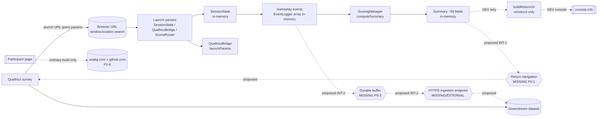

# Research-Data Privacy & Security Threat Model

Pre-pilot privacy, security and research-data-governance threat model for the
Remote Outpost Assessment game and its planned Qualtrics integration.

- **Prepared against**: branch `fable-autonomous-game-build-v1`, HEAD
  `1f2c972`, working tree clean.
- **Type**: documentation-only audit. No source, test, scoring, event-schema,
  stimulus or deployment-script file was modified. No INT-1/INT-2/INT-5/D2
  option was adopted. No scientific decision was made.
- **Companion documents**:
  `docs/ai/OPUS-PRE-PILOT-PRIVACY-SECURITY-GATE.md` (evidence and verdict),
  `docs/operations/PILOT-DATA-GOVERNANCE-CHECKLIST.md` (operational gates).
- **Builds on** (does not restate in full): the technical gate
  `docs/ai/OPUS-OVERNIGHT-PRE-PILOT-TECHNICAL-GATE.md`, the integration audit
  `docs/ai/PRE-MAX-QUALTRICS-INTEGRATION-AUDIT.md` (§7 P0/P1 register), and the
  decision pack `docs/decisions/QUALTRICS-INTEGRATION-DECISION-PACK.md`
  (INT-1..INT-6 options, §6 shared privacy/security implications).

Repository evidence is cited as `file:line`. Facts that cannot be answered from
the repository are tagged `[EXTERNAL]` and collected in the verification matrix.

---

## 1. Scope

**In scope**: everything the browser client generates, accepts, holds, derives,
displays, logs, or is _proposed_ to export; the launch URL and return URL; the
two deployment artifacts (`npm run build` vs `npm run bundle`); browser
persistence and cross-participant isolation; third-party/network exposure of the
participant bundle; debug/probe exposure; and the privacy/security constraints
that the later Max 5× Qualtrics-integration work must implement rather than
invent.

**Out of scope** (by task constraint): implementing the completion/return/export
pipeline; adopting INT-1/INT-2/INT-5/D2; selecting a persistence technology;
making legal, ethical, institutional or regulatory determinations. Those appear
here only as constraints on future work or as `[EXTERNAL]` verification items.

**Five assessment layers** (kept distinct throughout):

1. **Implemented** — behaviour that exists in `src/` today.
2. **Deployment artifact** — what `npm run build` / `npm run bundle` actually emit.
3. **Proposed-only** — INT-1/INT-2/INT-5/D2 options, none adopted.
4. **Operational (does-not-exist-yet)** — processes the researcher must run.
5. **External** — institutional/ethics facts the repository cannot settle.

---

## 2. System and data boundaries

| Boundary                      | Description                                                                                                                       | Trust                                                                                                              | Status                                                                 |
| ----------------------------- | --------------------------------------------------------------------------------------------------------------------------------- | ------------------------------------------------------------------------------------------------------------------ | ---------------------------------------------------------------------- |
| Qualtrics survey → launch URL | Survey pipes `participant_id`, `game_session_id`, `condition`, `return_url`, `game_version` into the game URL query string        | Qualtrics-controlled; **query string is user-visible & user-editable**                                             | implemented (parsed)                                                   |
| Launch URL → parsers          | `SessionState.ts:40-56`, `QualtricsBridge.ts:14-22`, `SceneRouter.ts:22` read `window.location.search`                            | Client (participant browser)                                                                                       | implemented                                                            |
| Parsers → runtime memory      | `EventLogger` in-memory array `EventLogger.ts:34-52`; `SessionState` object; `DataQualityTracker` metrics                         | Client memory only; **no persistence** (grep: zero `localStorage`/`sessionStorage`/`indexedDB`/`cookie` in `src/`) | implemented                                                            |
| Runtime → derived summary     | `ScoringManager.computeSummary()` derives ~59 fields from the event array                                                         | Client                                                                                                             | implemented                                                            |
| Summary → return URL          | `QualtricsBridge.buildReturnUrl()` appends every summary field as a query param `QualtricsBridge.ts:28-46`                        | Client → return destination                                                                                        | **DEV-only caller** (`completeDebugSession`); no production navigation |
| Return URL → Qualtrics        | _No production code navigates to it_ (`QualtricsBridge` grep: only `ResearchRuntime.completeDebugSession` calls `buildReturnUrl`) | —                                                                                                                  | **missing (P0-1)**                                                     |
| Raw events → server           | _No export exists_ (grep: no `fetch`/`XHR`/`WebSocket`/`sendBeacon`/`postMessage` in `src/`)                                      | —                                                                                                                  | **missing (P0-2)**                                                     |
| App → third parties           | Ordinary build only: `unpkg.com` github-corners script + `github.com` ribbon link in `dist/index.html`                            | Third-party CDN / GitHub                                                                                           | deployment artifact (P1-6)                                             |

**Implemented vs proposed at a glance**

- **Implemented**: launch-param parsing; in-memory event log; in-memory mission
  state; client-side scoring derivation; DEV-only debug API and feedback probe;
  inert `gtag` stub; return-URL _construction_ (no navigation).
- **DEV-only**: `window.researchRuntime`, `window.__lastRoomFeedbackText`,
  `completeDebugSession()` / `buildReturnUrl()` invocation (`ResearchRuntime.ts:189-208`,
  `RoomScene.ts:181-183,395-397`). All three are absent from the production JS
  (verified: grep count 0 in `dist/assets/index-*.js`).
- **Proposed-only (unauthorised)**: production completion trigger, return
  navigation, raw-event export channel, durable persistence buffer, status
  taxonomy, `asset_set_version` payload field, event sequence numbers.
- **Missing**: any production data destination; any test/production data
  separation signal; any persistence/durability; any return-scheme allowlist.

---

## 3. Data inventory

Sensitivity key: **DI** direct identifier · **PID** pseudonymous identifier ·
**LNK** potentially-linkable · **RSP** research response · **DRV** derived score ·
**OPS** operational metadata · **DIAG** diagnostic.

No **DI** (name, email, IP, device id) is collected by application code. IP is
observable at the network layer by any host/endpoint — `[EXTERNAL]`, not
in-repo.

| #   | Datum                                                                                      | Source                                    | Class             | Impl?                   | In memory        | In URL                         | In console (DEV)   | In prod artifact        | Export dest (proposed) | Necessary?                | Evidence                                         |
| --- | ------------------------------------------------------------------------------------------ | ----------------------------------------- | ----------------- | ----------------------- | ---------------- | ------------------------------ | ------------------ | ----------------------- | ---------------------- | ------------------------- | ------------------------------------------------ |
| 1   | `participant_id`                                                                           | launch URL / `crypto.randomUUID` fallback | **PID/LNK**       | yes                     | yes              | **launch + (proposed) return** | yes                | field-name literal only | Qualtrics + endpoint   | yes (linking key)         | `SessionState.ts:46`, `QualtricsBridge.ts:16`    |
| 2   | `game_session_id`                                                                          | launch URL / fallback                     | **PID/LNK**       | yes                     | yes              | **launch + (proposed) return** | yes                | field-name only         | Qualtrics + endpoint   | yes (join key)            | `SessionState.ts:48`                             |
| 3   | `condition`                                                                                | launch URL (`'default'` fallback)         | **OPS**           | yes                     | yes              | launch + return                | yes                | no                      | Qualtrics              | yes                       | `SessionState.ts:49`                             |
| 4   | `return_url`                                                                               | launch URL                                | **OPS/LNK**       | yes                     | yes              | **launch only**                | yes (DEV info log) | no                      | never re-exported      | yes (INT-1)               | `QualtricsBridge.ts:19`                          |
| 5   | `game_version`                                                                             | launch URL / `VITE_APP_VERSION`           | **OPS**           | yes                     | yes              | launch + return                | yes                | yes (engine banner)     | Qualtrics              | yes (provenance)          | `SessionState.ts:51`, `index.ts:20`              |
| 6   | `asset_set_version`                                                                        | `ASSET_SET_VERSION` const                 | **OPS**           | yes                     | no (banner only) | no                             | yes (banner)       | yes                     | proposed (INT-6, P1-8) | yes (stimulus provenance) | `constants/assets.ts:9`, `index.ts:20`           |
| 7   | `started_at_ms` / timestamps                                                               | `Date.now()`                              | **OPS**           | yes                     | yes              | no                             | yes                | no                      | via raw events         | yes                       | `SessionState.ts:54`, `ResearchRuntime.ts:63`    |
| 8   | `elapsed_seconds`                                                                          | derived                                   | **OPS/DRV**       | yes                     | yes              | return                         | yes                | no                      | Qualtrics + raw        | yes                       | `SessionState.ts:62-67`                          |
| 9   | Raw event array (`RawGameEvent[]`)                                                         | gameplay                                  | **RSP**           | yes                     | yes              | no (URL)                       | yes                | no                      | endpoint (proposed E)  | yes                       | `EventLogger.ts:1-52`                            |
| 10  | `event_type` / `object_id` / `room_id` / `task_id`                                         | gameplay                                  | **RSP**           | yes                     | yes              | no                             | yes                | no                      | raw                    | yes                       | `EventLogger.ts:4-31`                            |
| 11  | `choice_value` / option selections                                                         | gameplay                                  | **RSP**           | yes                     | yes              | no                             | yes                | no                      | raw                    | yes                       | `EventLogger.ts:26`                              |
| 12  | `construct_id` / `study_item_ids`                                                          | gameplay                                  | **RSP/LNK**       | yes                     | yes              | no                             | yes                | no                      | raw                    | yes                       | `EventLogger.ts:23-24`                           |
| 13  | Hazard / abandon / defer decisions                                                         | gameplay                                  | **RSP**           | yes                     | yes              | no                             | yes                | no                      | raw                    | yes                       | `HazardScene.ts:172-195`, `SessionState` duties  |
| 14  | Room/station status fields                                                                 | gameplay                                  | **RSP**           | yes                     | yes              | no                             | yes                | no                      | via summary/state      | yes                       | `SessionState.ts:15-28`                          |
| 15  | ~59 summary variables (`GameSummaryVariables`)                                             | `computeSummary`                          | **DRV**           | yes                     | yes              | **return (all fields)**        | yes                | field-names only        | Qualtrics              | yes                       | `ScoringManager.ts:5-65,153-223`                 |
| 16  | `completed` / `objective_completed`                                                        | derived                                   | **DRV**           | yes                     | yes              | return                         | yes                | no                      | Qualtrics              | yes                       | `ScoringManager.ts:91-92`                        |
| 17  | `data_quality_focus_loss_count/seconds`                                                    | `blur`/`visibilitychange`                 | **DIAG**          | yes                     | yes              | return                         | yes                | no                      | Qualtrics              | yes                       | `DataQualityTracker.ts:56-89`                    |
| 18  | `data_quality_technical_error_count`                                                       | app                                       | **DIAG**          | yes                     | yes              | return                         | yes                | no                      | Qualtrics              | yes                       | `DataQualityTracker.ts:52-54`                    |
| 19  | `launch_mode` / `session_status` / `completion_reason` / `export_status` / `return_status` | —                                         | **OPS**           | **no (proposed INT-5)** | —                | —                              | —                  | —                       | Qualtrics              | decision                  | decision pack §5                                 |
| 20  | Event sequence number                                                                      | —                                         | **OPS/integrity** | **no (proposed P1-9)**  | —                | —                              | —                  | —                       | raw                    | decision                  | audit P1-9                                       |
| 21  | `researchRuntime` debug API surface                                                        | dev helper                                | **DIAG**          | DEV-only                | yes              | no                             | yes                | **absent**              | —                      | n/a                       | `ResearchRuntime.ts:189-208`                     |
| 22  | `__lastRoomFeedbackText`                                                                   | dev probe                                 | **DIAG**          | DEV-only                | yes              | no                             | no                 | **absent**              | —                      | n/a                       | `RoomScene.ts:181-183,395-397`                   |
| 23  | `VITE_GOOGLE_ANALYTICS_ID`                                                                 | `.env` (**empty**)                        | **OPS**           | inert                   | no               | no                             | no                 | inert stub only         | none                   | no — remove               | `.env:4`, `analytics.ts` (not imported by entry) |

**Minimisation observations**

- The only participant-linkable data are **#1 `participant_id`** and **#2
  `game_session_id`** — both pseudonymous and _supplied by Qualtrics_, so
  Qualtrics already holds the mapping. Echoing them back into the **return URL**
  (#15 path) is largely redundant and is the main URL-exposure surface (see §6,
  PS-4). Whether the return URL must echo `participant_id` is an **owner
  decision**, not a technical necessity.
- No datum in the inventory is an unnecessary direct identifier. The app does
  **not** collect free-text, name, email, IP, or device fingerprint.
- Datum #23 (GA id) is unnecessary for the research objective and should be
  removed from the participant build to eliminate ambiguity (PS-9).

---

## 4. Data-flow model

### 4.1 Diagram (implemented + proposed)

### 4.2 Boundary table

| #   | Component           | Input                  | Output          | Trust boundary                                         | Persistence         | Possible observer                                | Failure behaviour                         | Current control                                       | Missing control                             | Evidence status                     |
| --- | ------------------- | ---------------------- | --------------- | ------------------------------------------------------ | ------------------- | ------------------------------------------------ | ----------------------------------------- | ----------------------------------------------------- | ------------------------------------------- | ----------------------------------- |
| B1  | Launch URL          | Qualtrics params       | query string    | **participant ↔ app** (URL is client-visible/editable) | browser history     | participant, browser history, Referer, host logs | malformed → fallback IDs                  | `URLSearchParams` parse; `crypto.randomUUID` fallback | empty-string guard (P1-5); param validation | verified                            |
| B2  | `SessionState` ctor | search params          | metadata        | in-process                                             | none                | —                                                | absent param → random id                  | fallback ids                                          | empty-string → still empty (PS-8)           | verified `SessionState.ts:44-56`    |
| B3  | `EventLogger`       | events                 | in-memory array | in-process                                             | **none (volatile)** | —                                                | reload/close → **total loss**             | defensive copy                                        | durability (P0-3/PS-3)                      | verified                            |
| B4  | `computeSummary`    | events                 | summary         | in-process                                             | none                | —                                                | pure function                             | additive/optional fields                              | scoring version stamp (D2)                  | verified                            |
| B5  | `buildReturnUrl`    | summary + `return_url` | URL string      | **app → return destination**                           | none                | —                                                | invalid `return_url` → `null` (try/catch) | try/catch; null-guard                                 | **scheme/host allowlist (INT-4/PS-0)**      | verified `QualtricsBridge.ts:35-45` |
| B6  | Return navigation   | URL                    | —               | app → Qualtrics                                        | —                   | history/Referer                                  | —                                         | **none (no prod caller)**                             | whole feature (P0-1) + PS-0/PS-4            | verified absent                     |
| B7  | Raw export          | events                 | —               | app → server                                           | —                   | endpoint host                                    | —                                         | **none**                                              | channel + auth + region (INT-2/PS-5)        | verified absent                     |
| B8  | Third-party fetch   | —                      | script/link     | app → CDN/GitHub                                       | —                   | unpkg, GitHub, network path                      | script load                               | **`npm run bundle` strips it**                        | pin bundle as artifact (P1-6/PS-1)          | verified                            |

---

## 5. Trust boundaries (summary)

1. **Participant ↔ launch URL** — the participant controls and can edit every
   query parameter (identity, condition, `return_url`, `scene`). Nothing in the
   URL can be trusted for integrity; identity can be forged/omitted; `return_url`
   is attacker-influenceable. Controls belong at parse and at return time.
2. **App ↔ return destination** — the return URL is built from an
   attacker-influenceable input; the destination must be constrained
   (allowlist) before any navigation ships.
3. **App ↔ server (future)** — a raw-event endpoint or `postMessage` peer is a
   new trust boundary needing origin/auth/transport controls.
4. **App ↔ third parties** — the ordinary build reaches `unpkg.com` and links
   `github.com`; the participant bundle does not. The deployed artifact must be
   the bundle.
5. **DEV ↔ PROD** — debug API, feedback probe, and return construction live
   behind `import.meta.env.DEV` and are verified absent from the production
   bundle; this boundary is currently sound.

---

## 6. Privacy/security finding register

IDs are `PS-n` (privacy/security), cross-mapped to the existing technical
findings (`P0-1..P2-13`, `INT-1..INT-6`). "Affected level" uses **L1** internal
dev, **L2** supervised usability (non-study data), **L3** supervised pilot,
**L4** formal collection.

| ID        | Classification                                    | Sev                     | Affected level | Finding                                                                                                                                                                                                                                                                                                                                     | Current control                                                             | Required control                                                                                                                  | Owner                             | Maps                                                |
| --------- | ------------------------------------------------- | ----------------------- | -------------- | ------------------------------------------------------------------------------------------------------------------------------------------------------------------------------------------------------------------------------------------------------------------------------------------------------------------------------------------- | --------------------------------------------------------------------------- | --------------------------------------------------------------------------------------------------------------------------------- | --------------------------------- | --------------------------------------------------- |
| **PS-0**  | missing security contract                         | **P0** (on INT-1 land)  | L3/L4          | `buildReturnUrl` resolves `return_url` with **no scheme/host allowlist**; a `javascript:`/off-site URL would be constructed. Latent today (no prod navigation), becomes live open-redirect/XSS sink the moment INT-1 navigation ships                                                                                                       | try/catch → `null` on parse failure only                                    | http(s)-only + **exact-host allowlist**; reject → fallback UI; never `location=` an unvalidated URL                               | research owner (INT-4) + Max impl | `QualtricsBridge.ts:35-45`, INT-1 §3.2, INT-4       |
| **PS-1**  | deployment/config                                 | **P0 at L4** / P1 at L3 | L3/L4          | Participant-facing artifact must be `npm run bundle`; the **ordinary `npm run build` (and the previously committed `dist/`) emits an external `unpkg.com` request + `github.com` third-party link** and base `/`                                                                                                                            | `bundle` strips both (verified)                                             | Deployment procedure pins `npm run bundle`; pre-deploy grep asserts **zero** external URLs                                        | infra/config (Sonnet)             | `index.html:22-39`, P1-6                            |
| **PS-2**  | test-data separation                              | **P0**                  | L3/L4          | No `launch_mode`/`is_test` signal in any payload; `crypto.randomUUID` fallback makes dev/test sessions look like valid sessions → dev/test data can enter the production dataset and vice-versa, undetectably                                                                                                                               | none                                                                        | Adopt INT-5 `launch_mode` axis + reserved test-id convention + analysis-time exclusion                                            | research owner (INT-5)            | INT-5 §5, P1-7                                      |
| **PS-3**  | missing operational control                       | **P0**                  | L3/L4          | **No persistence** → reload/crash/close mid-session loses all events irrecoverably; no durable buffer exists to namespace/expire/ack-clear per session                                                                                                                                                                                      | in-memory only (a reload clears everything — incidentally isolates devices) | Durable per-session buffer with the §7 constraints; ack-clear on export                                                           | research owner (P0-3) + Max       | grep (no storage), P0-3                             |
| **PS-4**  | missing privacy contract                          | **P1**                  | L3/L4          | Proposed return URL carries `participant_id` + `game_session_id` + all ~59 summary fields as query params → browser history, **Referer**, host logs, copied/shared URLs                                                                                                                                                                     | none (feature not built)                                                    | Return URL = summary only; **raw events never in URL**; minimise identity echo (owner decides whether `participant_id` is needed) | research owner (INT-1/INT-2)      | decision pack §4.1, §6                              |
| **PS-5**  | missing security contract                         | **P1**                  | L3/L4          | A raw-event ingestion endpoint or `postMessage` channel widens the data surface: needs HTTPS, auth, fixed origin (never `'*'`), schema+origin validation, ack correlation, replay/duplicate protection                                                                                                                                      | none (not built)                                                            | Per §7.3/§7.4 constraint set; endpoint host/region/retention `[EXTERNAL]`                                                         | institution/infra + Max           | INT-1 B, INT-2 C/D/E, §6                            |
| **PS-6**  | deployment/config                                 | **P1**                  | L3/L4          | `scripts/bundle.sh` packaging step (`zip`, `open`) is not cross-platform; the artifact-production process is unverified on the Windows build host → risk the deployed artifact differs from the audited one                                                                                                                                 | build step works; packaging step fails on Windows                           | Documented, reproducible artifact build + a recorded pre-deploy integrity check (hash/grep)                                       | infra/config                      | `bundle.sh:7-14`                                    |
| **PS-7**  | research-validity integrity                       | **P1**                  | L3/L4          | No event sequence numbers (ordering = push order + ms timestamp, collidable); no idempotency key → duplicate export/submission undetectable                                                                                                                                                                                                 | ms timestamps                                                               | Monotonic per-session seq + composite idempotency key (`participant_id`+`game_session_id`+`export_id`) + export receipt           | Max (P1-9/INT-2.5)                | `EventLogger.ts`, P1-9                              |
| **PS-8**  | missing security contract                         | **P1**                  | L3/L4          | Empty-string launch identity (`participant_id=''`) is non-null so the `crypto.randomUUID` fallback is bypassed → two empty-identity launches can collide / misattribute                                                                                                                                                                     | none                                                                        | INT-3 empty-identity rule (reject/flag/replace)                                                                                   | research owner (INT-3)            | `SessionState.ts:46-48`, P1-5                       |
| **PS-9**  | deployment/config                                 | **P2**                  | L3/L4          | Inert `gtag` stub + empty GA id remain in the participant HTML (no network today: analytics module tree-shaken, ID empty) — dead third-party scaffolding that could be accidentally activated                                                                                                                                               | inert (verified no network)                                                 | Remove the gtag stub from the research build                                                                                      | config (Sonnet)                   | `index.html:46-53`, `.env:4`, P2-10                 |
| **PS-10** | deployment/config                                 | **P2**                  | L3/L4          | Stale template metadata in the participant artifact (`<title>Phaser RPG`, manifest `Phaser RPG`, `remarkablegames.org` homepage, template icons/robots) — not a data leak; misdirection/professional-appearance                                                                                                                             | none                                                                        | Replace shell metadata for the research build                                                                                     | config (Sonnet)                   | `dist/index.html`, `dist/manifest.json`, P2-10      |
| **PS-11** | research-validity integrity / accepted limitation | **P2**                  | L3/L4          | Scientific mappings (`researchInteractions`, scoring formulas, event names, `construct_id`) ship in the client bundle **by architecture**; a motivated participant could reverse-engineer intended scoring. **Not** a confidentiality defect (no participant data, no secrets). Contract already forbids showing Q01-Q33 wording to players | client-side app architecture; wording-leak prohibition (CLAUDE.md)          | Accept as inherent to a client-side assessment; keep a wording-leak check in review; note gaming risk for analysis                | research owner (accept)           | `ScoringManager.ts`, `data/researchInteractions.ts` |
| **PS-12** | external institutional verification               | n/a                     | L4             | Participant IP/geolocation is observable by any host/endpoint at the network layer; region, provider and retention are not in-repo                                                                                                                                                                                                          | none in-repo                                                                | Confirm approved storage region/provider/retention                                                                                | institution/ethics                | `[EXTERNAL]`                                        |
| **PS-13** | no issue (documented)                             | —                       | —              | **No hard-coded secrets, tokens, API keys or endpoints** in `src/` (grep clean); **no source maps** in either build; `.env` holds only npm vars + empty GA id                                                                                                                                                                               | —                                                                           | maintain (secret-scan on future config)                                                                                           | —                                 | grep, `find dist -name '*.map'` = 0, `.env`         |

---

## 7. Required privacy/security controls (constraint set for Max)

These are **implementation-ready constraints**, not adoptions. The later Fable
sessions must satisfy them rather than invent their own controls. Each names the
gating decision it depends on.

### 7.1 Launch URL / identity (implements PS-2, PS-8)

- Treat every query parameter as untrusted input.
- Define behaviour for **empty-string** identity (INT-3 ruling): reject, flag,
  or replace — do not silently accept `''`.
- Carry a `launch_mode` signal (INT-5) so test/dev sessions are downstream-
  separable; adopt a reserved test-id convention.
- Do not preserve prior-participant parameters across sessions (no persistence
  today makes this safe; the future buffer must namespace per session — §7.5).

### 7.2 Return URL — mandatory constraints for INT-1 options (implements PS-0, PS-4)

Specified **without selecting a mechanism**:

- **Allowed schemes**: `https:` (and `http:` only if the survey host requires
  it, per owner) — reject all others (`javascript:`, `data:`, `file:`, …).
- **Exact-origin allowlist**: the return host(s) must be an explicit allowlist,
  configured out-of-band; reject any non-matching origin → fallback UI.
- **Never** assign an unvalidated string to `location.href`/`assign`/`replace`.
- **Payload discipline**: return URL carries **summary fields only**; **raw
  events never** travel in a URL (length + history/Referer exposure).
- **Identity minimisation**: echo the minimum identity needed for Qualtrics to
  re-join (owner decides whether `participant_id` is required in the return).
- **Malformed/duplicate/oversized/empty** `return_url` → deterministic fallback
  UI ("your session is complete; data may not have been returned"), never a
  white-screen.

### 7.3 postMessage channel — mandatory constraints (if INT-1 B / INT-2 C adopted) (implements PS-5)

- Fixed **exact target origin** on `postMessage` — never `'*'`.
- Verify `event.origin` against the allowlist on receive; verify the
  source/parent window.
- Validate message **type and schema** before acting.
- **Acknowledgement correlation**: correlate ack to a specific export/session id.
- **Replay + duplicate-completion protection**: idempotency key; ignore repeats.
- Validate any navigation destination derived from a message.

### 7.4 Raw-event export endpoint — mandatory constraints (if INT-2 A/D/E adopted) (implements PS-5, PS-7, PS-12)

- HTTPS only; authenticated as institutionally required `[EXTERNAL]`.
- Send **pseudonymous** raw events only (no DI added).
- Idempotent ingestion keyed on `participant_id`+`game_session_id`+`export_id`.
- Monotonic per-session **sequence numbers** for append-only ordering (PS-7).
- Endpoint **host, region, provider, retention** are `[EXTERNAL]` and must be
  approved before any real-participant traffic.

### 7.5 Durable persistence buffer — mandatory design constraints (implements PS-3)

Do **not** select a technology (localStorage/IndexedDB) — that is INT-2's
Option-E decision. When a buffer is built it **must**:

- **Namespace per session** (`participant_id`+`game_session_id`) — no
  cross-session/cross-participant bleed.
- Carry a **schema version** and a **write timestamp**.
- Define an **expiry** and clear acknowledged-exported data on ack.
- **Preserve incomplete sessions** for best-effort later export; define
  completed-session **re-entry** behaviour.
- Handle **corruption** (bad JSON → quarantine, do not crash) and
  **storage-quota** exhaustion (defined degradation).
- Keep **test vs production** records separable (ties PS-2).
- Provide **cross-participant isolation** on shared devices and a
  manual/automatic **cleanup** path.
- Store **no unnecessary identifying data**.

### 7.6 Deployment artifact (implements PS-1, PS-6, PS-9, PS-10)

- The participant artifact is **`npm run bundle`** output only; the ordinary
  `npm run build` is never shipped to participants.
- A recorded pre-deploy check: `grep -oE "https?://[^" ]+" dist/index.html`
  returns nothing; base path is `./`; no `*.map`.
- Remove the inert `gtag` stub and replace stale shell metadata for the research
  build.
- Make `bundle.sh` cross-platform / documented so the emitted artifact is
  reproducible and hash-verifiable.

---

## 8. Integration-option compatibility (INT-1/INT-2/INT-5/D2)

No option is selected or approved here. Verdicts: **✓** compatible without extra
controls · **⊕** compatible only with the named controls · **✗** not
recommended on privacy/security grounds · **?** cannot assess until an
`[EXTERNAL]` decision is known.

| Decision  | Option                                      | Verdict | Privacy/security condition                                                                             |
| --------- | ------------------------------------------- | ------- | ------------------------------------------------------------------------------------------------------ |
| **INT-1** | A same-window `return_url` nav              | **⊕**   | Requires PS-0 allowlist (INT-4) + PS-4 payload discipline before it can ship                           |
| INT-1     | B postMessage+ack                           | **⊕**   | Requires §7.3 postMessage constraints (exact origin, schema, ack, replay)                              |
| INT-1     | C hybrid                                    | **⊕**   | Union of A + B constraints                                                                             |
| INT-1     | D manual button only                        | **✓**   | Lowest surface; still needs PS-0 if the button navigates a `return_url`                                |
| INT-1     | Launch mode standalone vs embedded          | **?**   | `[EXTERNAL]` survey-design decision; changes which channel constraints apply                           |
| **INT-2** | A HTTPS endpoint                            | **⊕**   | §7.4 endpoint constraints; host/region/retention `[EXTERNAL]`                                          |
| INT-2     | B Qualtrics embedded-data only              | **✓**   | Summary-only; no new endpoint surface (still PS-4)                                                     |
| INT-2     | C parent-window messaging                   | **⊕**   | §7.3 postMessage constraints                                                                           |
| INT-2     | D hybrid (summary→Qualtrics + raw→endpoint) | **⊕**   | §7.3 (or §7.2) + §7.4 + §7.5 buffer                                                                    |
| INT-2     | E local durable queue → acked export        | **⊕**   | §7.5 buffer constraints are mandatory (also discharges PS-3)                                           |
| INT-2     | F summaries-only                            | **✓**   | Smallest data surface; still PS-4 on the return URL; accept reproducibility loss                       |
| **INT-5** | A combined enum                             | **⊕**   | Must include a `launch_mode`/test axis to satisfy PS-2                                                 |
| INT-5     | B orthogonal dimensions                     | **✓**   | Directly satisfies PS-2 (has `launch_mode`)                                                            |
| INT-5     | C minimal (`session_status`+`is_test`)      | **✓**   | Satisfies PS-2 minimally                                                                               |
| **D2**    | α minimal remediation                       | **✓**   | Scoring shape only; no new privacy/security surface. `scoring_version` stamp aids PS-7 reproducibility |
| D2        | β full V3 §6 migration                      | **?**   | No privacy/security objection; blocked on scientific grounds elsewhere, not here                       |

**Ruling-form gap**: the current `RESEARCH-OWNER-RULING-FORM.md` covers the
INT-1.5 return scheme/host allow-list (good) but has **no explicit fields** for:
(a) test/production separation signal (PS-2), (b) return-URL identity
minimisation (PS-4), (c) endpoint region/provider/retention approval (PS-5/
PS-12), (d) participant-withdrawal/deletion handling `[EXTERNAL]`. These are
added as a clearly-marked new section (see the ruling-form update).

---

## 9. Verification matrix

| Item                                        | How verified                                                       | Result / status            | Evidence                |
| ------------------------------------------- | ------------------------------------------------------------------ | -------------------------- | ----------------------- |
| No browser persistence in `src/`            | grep `localStorage\|sessionStorage\|indexedDB\|cookie`             | **none**                   | grep clean              |
| No network calls in `src/`                  | grep `fetch\|XHR\|WebSocket\|sendBeacon\|postMessage\|EventSource` | **none**                   | grep clean              |
| Debug API absent from prod JS               | grep `researchRuntime` in `dist/assets/index-*.js`                 | **0**                      | build                   |
| Feedback probe absent from prod JS          | grep `__lastRoomFeedbackText` in prod JS                           | **0**                      | build                   |
| Analytics absent from prod JS               | grep `googletagmanager\|gtag` in prod JS                           | **0** (tree-shaken)        | build                   |
| Bundle strips unpkg + ribbon                | `grep -oE "https?://" dist/index.html` after `bundle`              | **none**                   | bundle build            |
| Ordinary build ships externals              | same grep after `npm run build`                                    | `unpkg.com` + `github.com` | build                   |
| No source maps                              | `find dist -name '*.map'`                                          | **0**                      | build                   |
| No secrets/endpoints in src                 | grep secret/token/url patterns                                     | **none**                   | grep                    |
| Return-URL allowlist                        | code inspection                                                    | **absent (PS-0)**          | `QualtricsBridge.ts:35` |
| Return navigation in prod                   | grep `location.href/assign/replace` to return                      | **absent (P0-1)**          | grep                    |
| Approved ethics protocol / consent          | —                                                                  | **`[EXTERNAL]`**           | —                       |
| Approved storage region/provider/retention  | —                                                                  | **`[EXTERNAL]`**           | —                       |
| Withdrawal/deletion procedure               | —                                                                  | **`[EXTERNAL]`**           | —                       |
| Ingestion endpoint permitted                | —                                                                  | **`[EXTERNAL]`**           | —                       |
| Qualtrics permitted to store summary fields | —                                                                  | **`[EXTERNAL]`**           | —                       |

---

## 10. External-verification register

Facts that **cannot** be settled from the repository. None is asserted satisfied.

| #   | External requirement                                              | Blocks        | Owner                   |
| --- | ----------------------------------------------------------------- | ------------- | ----------------------- |
| X1  | Approved ethics protocol covering the game task                   | L3/L4         | ethics board            |
| X2  | Consent wording (incl. data-handling, third parties)              | L3/L4         | research owner + ethics |
| X3  | Institutional data-retention & deletion policy                    | L4            | institution             |
| X4  | Approved storage region for participant data                      | L4            | institution             |
| X5  | Approved service providers (Qualtrics tier, endpoint host)        | L4            | institution             |
| X6  | Participant withdrawal / deletion procedure                       | L4            | research owner + ethics |
| X7  | Data-access permissions (who may access raw/derived)              | L4            | research owner          |
| X8  | Breach / incident procedure                                       | L3/L4         | institution             |
| X9  | Whether Qualtrics may store the proposed summary fields           | L4            | institution/DPIA        |
| X10 | Whether a separate ingestion service is institutionally permitted | L3/L4 (INT-2) | institution/infra       |
| X11 | DPIA covering raw-event export (richer than summary)              | L4            | ethics/DPO              |

---

## 11. Accepted limitations

- **Client-side scientific mappings** (PS-11) are inherent to a browser-delivered
  assessment; treated as an accepted limitation with a residual gaming/validity
  note, not a confidentiality defect.
- **In-memory-only volatility** is a _current_ data-loss risk (PS-3) but also
  _currently_ provides cross-participant isolation on shared devices; the future
  buffer must not regress that isolation.
- This audit did **not** run the full Playwright suite, ADV-5, real Qualtrics
  surveys, external ingestion, or any active attack (task constraint). Runtime
  network observation was limited to static artifact inspection and local build
  output; no live third-party contact was made.
- Severities are **qualitative**; no numeric probabilities are asserted.

---

## 12. Definition of done

This threat model is complete when: (a) the Max integration sessions have the
§7 constraint set to implement rather than invent; (b) every finding is
evidence-grounded and mapped to an owner and a gating decision; (c)
implemented / DEV-only / proposed / missing / external are kept distinct; (d)
no INT/D2 option and no scientific decision was adopted; (e) the repository is
left at one clean documentation checkpoint. **Real participant data collection
(L4) is prohibited until PS-0, PS-1, PS-2, PS-3 and the P0 cluster
(P0-1..P0-4) are closed and X1..X11 confirmed.**
